

    

 
<h2 align='center' >Provided by Xiaomi Mione Team </h2>
 

  Mone是以微服务为核心的一站式企业协同研发平台。支持公共云、专有云和混合云多种部署形态；提供从“项目创建->开发->部署->治理->应用观测”端到端的研发全流程服务。
  Mone通过云原生新技术和研发新模式，打造“双敏”，敏捷研发和敏捷组织，保障小米-中国区高复杂业务、大规模团队的敏捷研发协同，实现多倍效能提升。

## ✨ Features
- 🌈 项目全生命周期管理
- 📦 持续集成、持续交付
- 🛡 Dayu微服务治理
- ⚙️ Tesla网关
- 🌍 Hera应用可观测平台
- 🎨 FaaS平台
- ⚙️ API管理平台

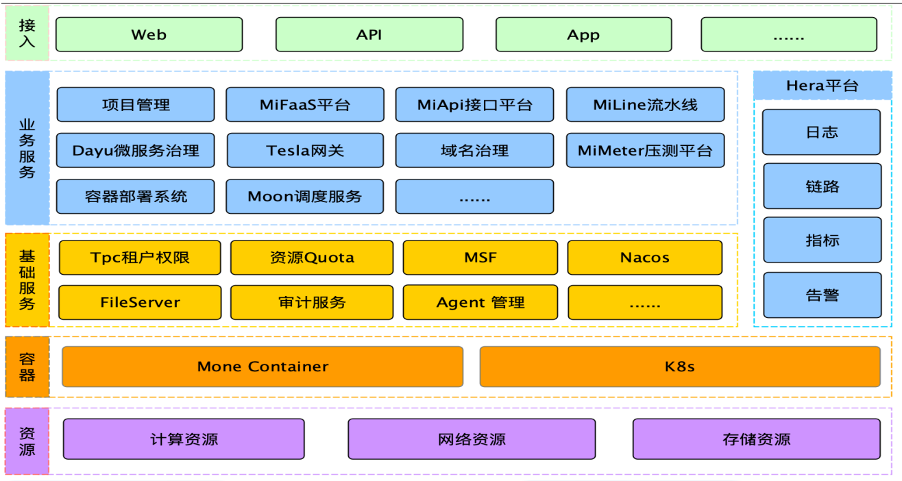

## 🔗 产品介绍

- [首页]

  

### [应用管理]
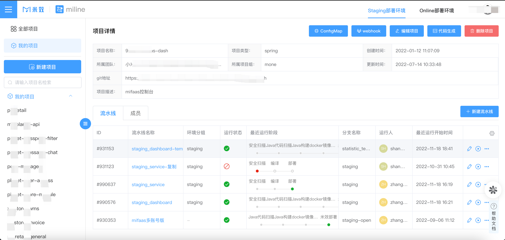

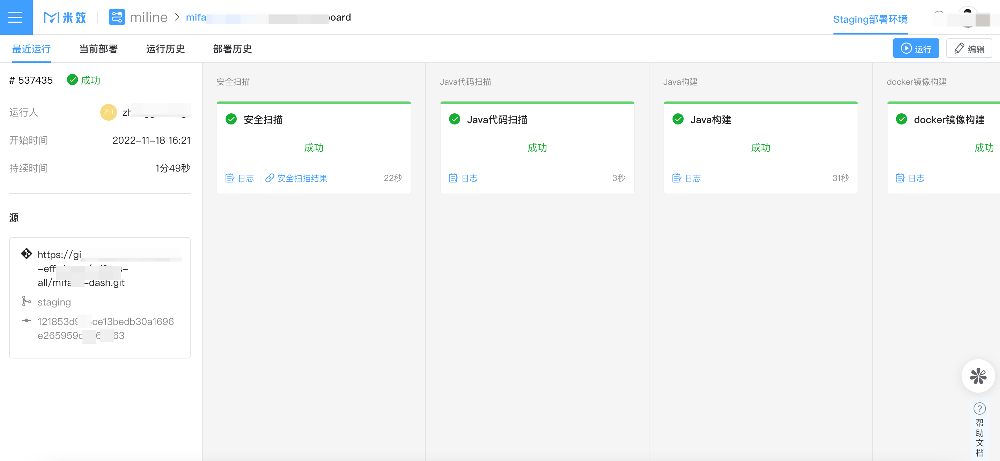
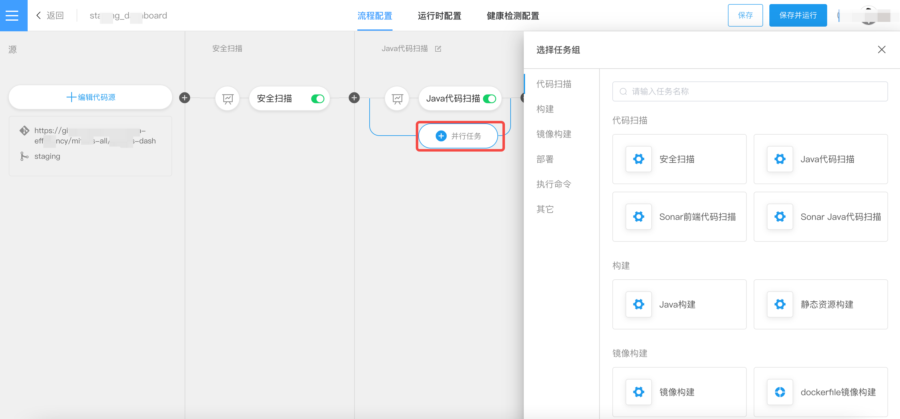
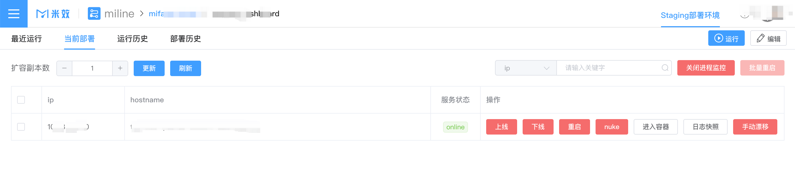

### [智能网关]
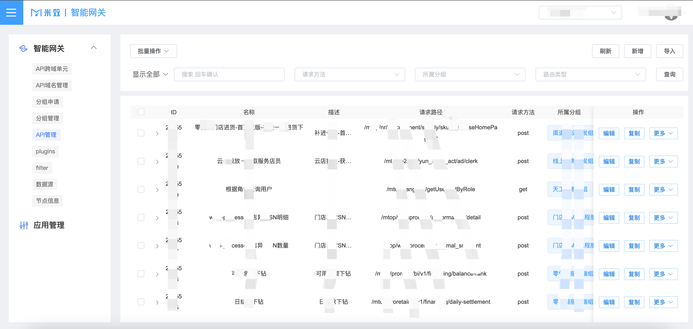
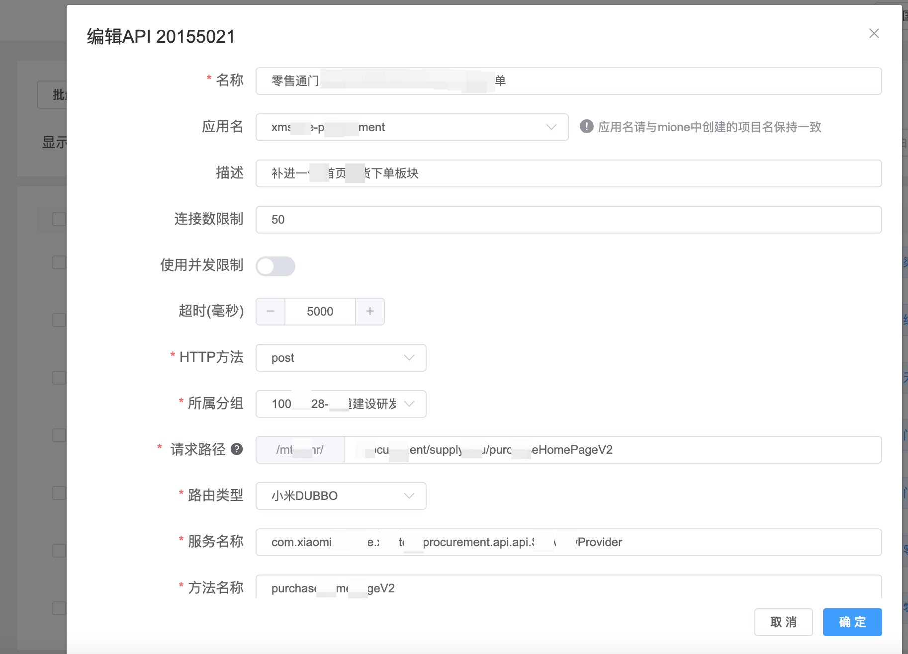
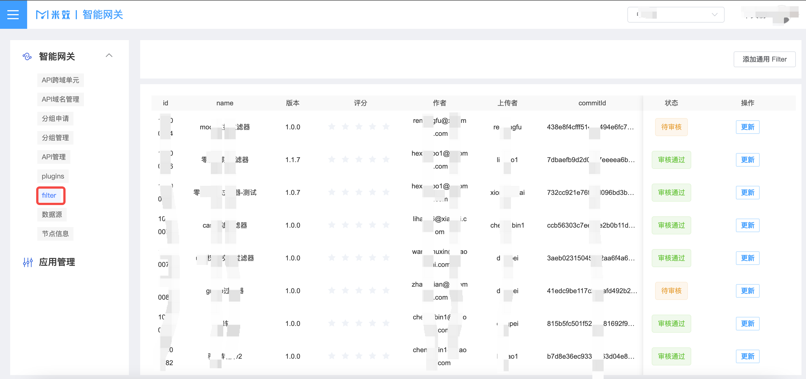

### [Hera可观测平台]
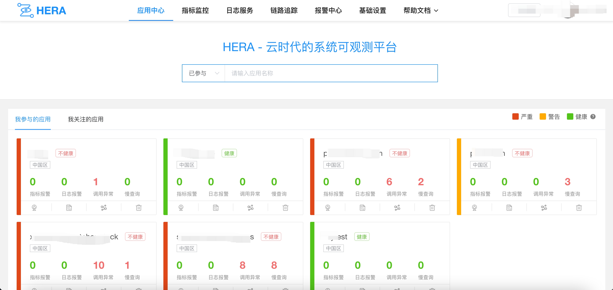
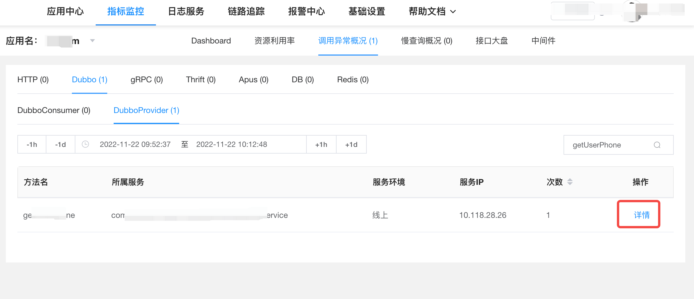
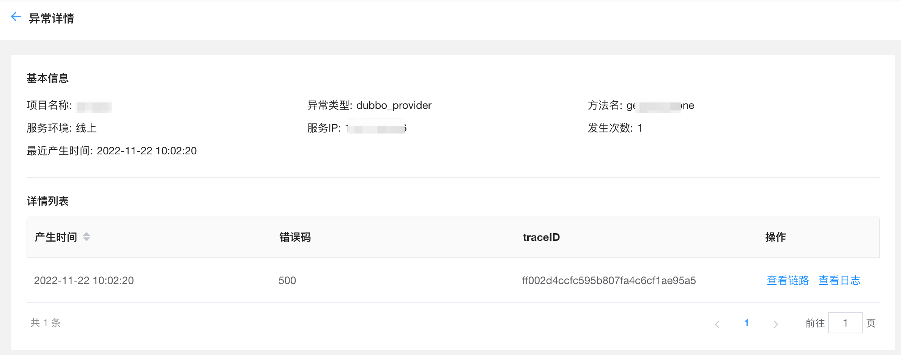
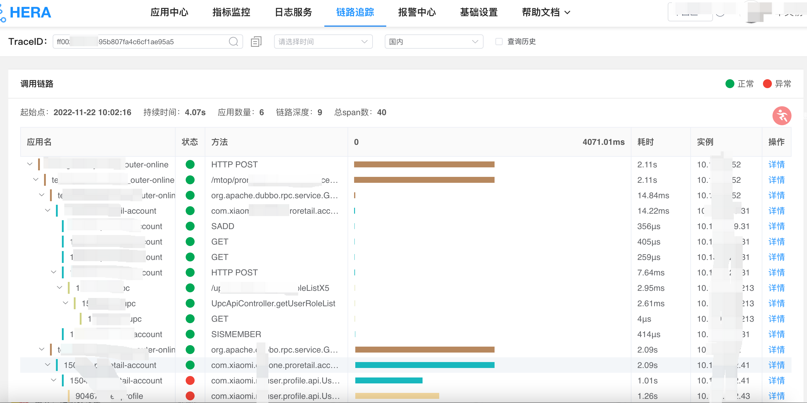
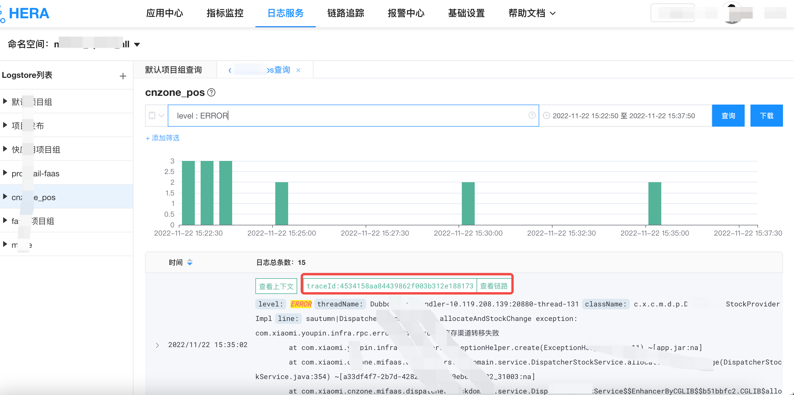
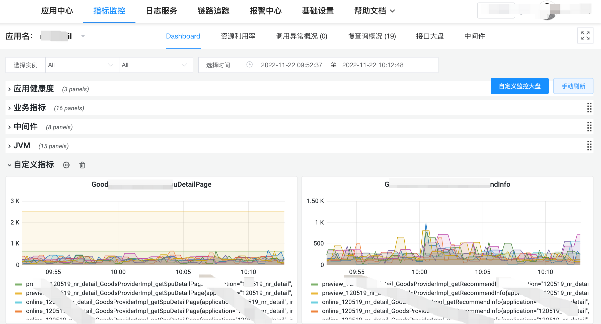
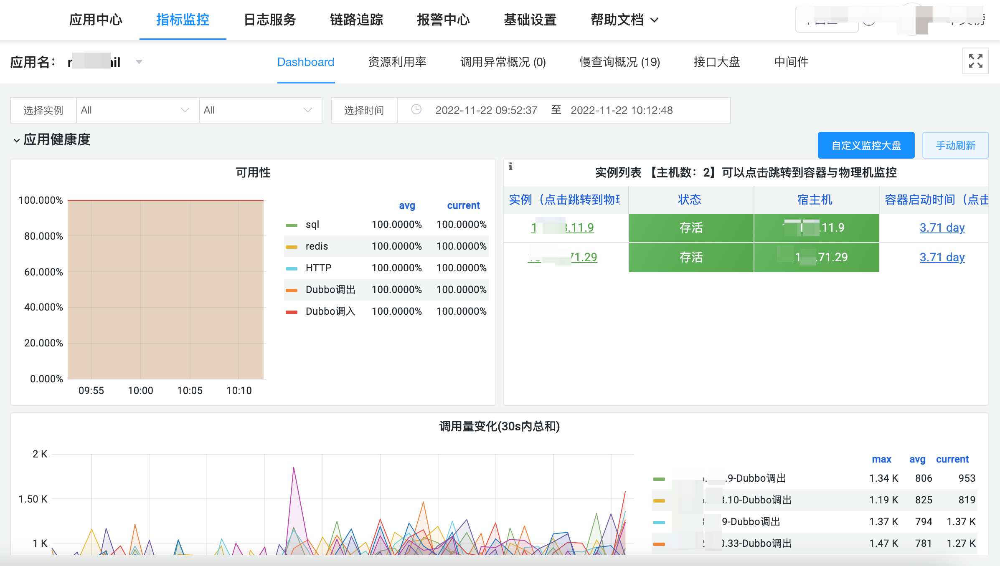
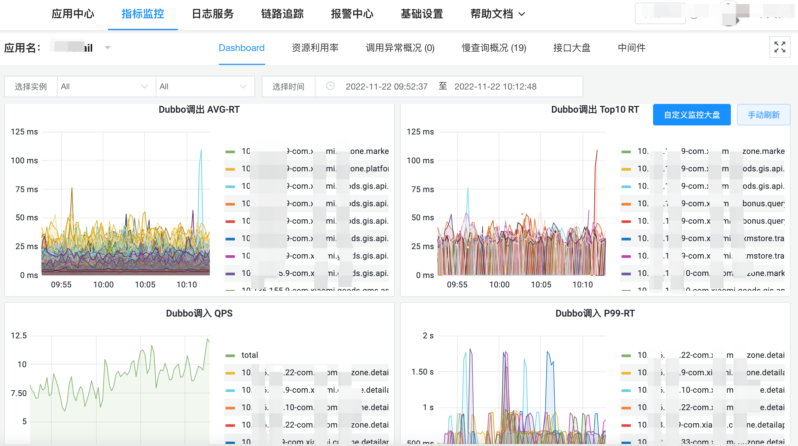

### [API管理平台]
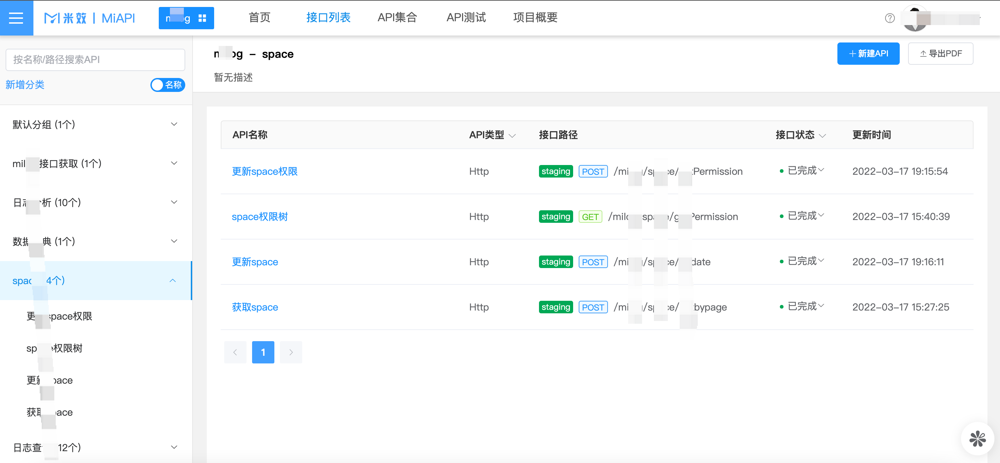
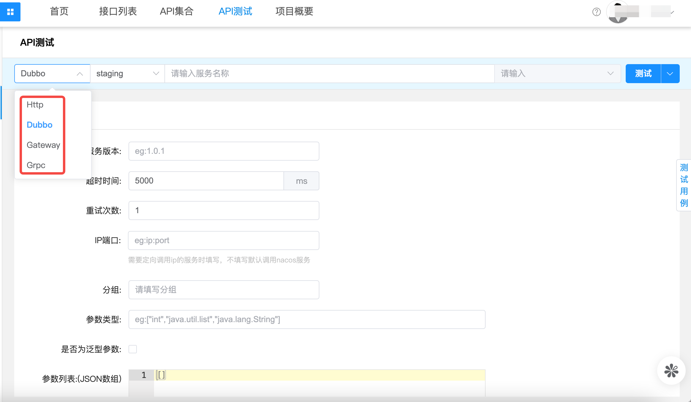
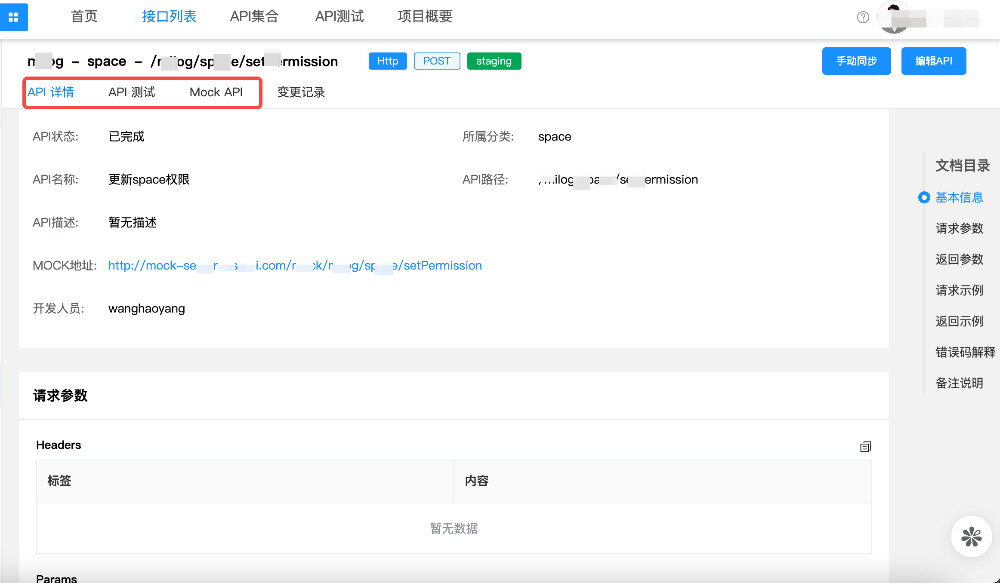

## 📃 文档

 想要了解更多或快速入门[快速入门](http://mone.xiaomiyoupin.com/#/doc/1)，请参照 [米效官网](http://mone.xiaomiyoupin.com/#/index)
 
## 🔨维护者

**owners:**
- 邢鑫岩                                                                                                                     
- 张志勇
- 单文榜
- 任清福
- 丁佩

**committers:**
- 张平
- 高一波
- 董振兴
- 王志东
- 丁涛
- 张校炜
- 张高峰
- 王涛
- 王敏
- 高希辉
- 王浩阳
- 谭琳琳
- 刘玉冲
- 张秀华
- 许铮
- 支明
- 陈磊
- 郑浩
    
 ## 📞 联系我们

 📮 邮箱 : mione@xiaomi.com
 
