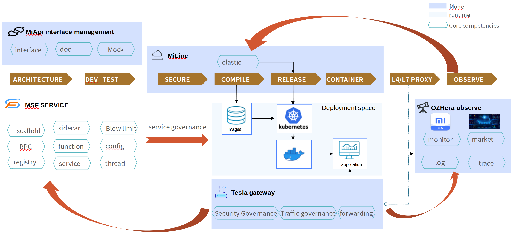

<div align='center'>
    <a href="https://github.com/XiaoMi/mone">
      
    </a>
</div>
<div align='center'>
<br>
<h2 align='center' >Provided by Xiaomi Mione Team </h2>
<br>
</div>

  Mone is a one-stop enterprise collaborative Research and Development platform centered on microservices. It supports various deployment forms such as public cloud, private cloud, and hybrid cloud; it provides end-to-end R&D full-process services from "creation -> development -> deployment -> governance -> observation".  
  Mone creates "dual agility", agile R&D and agile organization through new cloud-native technologies and new R&D models,  to ensure the agile R&D collaboration of Xiaomi's high-complexity business and large-scale teams in the China region, achieving multiple efficiency improvements.

## ✨ Architecture
### Product Architecture

### Improving Efficiency Across the Entire R&D Process



## ✨ Features
- 🌈 Full Lifecycle Project Management
- 📦 Continuous Integration, Continuous Delivery
- 🛡 Dayu - Microservice Governance
- ⚙️ Tesla Gateway
- 🌍 OzHera - Application Observability Platform
- 🎨 FaaS Platform
- ⚙️ API Management Platform


## 🔗 Mone introduction

### [Home Page]

<div align='center'>
  <a href="https://github.com/XiaoMi/mone">
    
  </a>
</div>

### [Application Management]


### [Tesla Gateway]


### [OzHera - Application Observability Platform]


### [API Management Platform]


## Getting started
    todo...

## 📃 Document

To learn more or get started quickly [Quick Start](http://mone.xiaomiyoupin.com/#/doc/1)，please refer to the [Mone Official Website](http://mone.xiaomiyoupin.com/#/index)
 
## 🔨Contributing

**owners:**
- Xinyan Xing
- Jinliang Ou
- Zhiyong Zhang
- Wenbang Dan
- Qingfu Ren
- Pei Ding

**committers:**
- Ping Zhang
- Baoyu Cao
- Yibo Gao
- Zhenxing Dong
- Zhidong Wang
- Tao Ding
- Xiaowei Zhang
- Gaofeng Zhang
- Tao Wang
- Min Wang
- Xihui Gao
- Haoyang Wang
- Linlin Tan
- Chuankang Liu
- Yandong Wang
- Yulin Gao
- Ting Kang
- Yuchong Liu
- Xiuhua Zhang
- Zheng Xu
- Ming Zhi
- Lei Chen
- Hao Zheng
    
 ## 📞 Contact


 + 📮 Mailing list:
   + mione@xiaomi.com
 + 📮 Wechat official account
   + 天穹云原生
 + 📮 Forum
   + [Mone](https://m.one.mi.com/)


## *License*
Mone is released under the [Apache 2.0 license](LICENSE).

```
Copyright 2020 XiaoMi.

Licensed under the Apache License, Version 2.0 (the "License");
you may not use this file except in compliance with the License.
You may obtain a copy of the License at the following link.

     http://www.apache.org/licenses/LICENSE-2.0

Unless required by applicable law or agreed to in writing, software
distributed under the License is distributed on an "AS IS" BASIS,
WITHOUT WARRANTIES OR CONDITIONS OF ANY KIND, either express or implied.
See the License for the specific language governing permissions and
limitations under the License.
```
## User List

If you are using [XiaoMi/mone](https://github.com/w1zirn/mone) and think that it helps you or want to contribute code for mone, please add your company to the user list to let us know your needs.

||||
| :---: | :---: | :---: |

