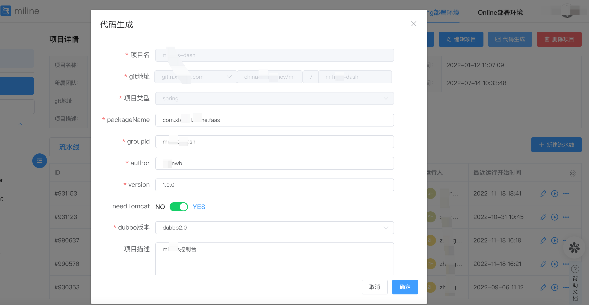

<div align='center'>
    <a href="https://github.com/XiaoMi/mone">
      
    </a>
</div>
<div align='center'>
<br>
<h2 align='center' >Provided by Xiaomi Mione Team </h2>
<br>
</div>

  Mone是以微服务为核心的一站式企业协同研发平台。支持公共云、专有云和混合云多种部署形态；提供从“项目创建->开发->部署->治理->应用观测”端到端的研发全流程服务。
  Mone通过云原生新技术和研发新模式，打造“双敏”，敏捷研发和敏捷组织，保障小米-中国区高复杂业务、大规模团队的敏捷研发协同，实现多倍效能提升。

## ✨ Architecture
### 产品架构

### 研发全流程提效


## ✨ Features
- 🌈 项目全生命周期管理
- 📦 持续集成、持续交付
- 🛡 Dayu微服务治理
- ⚙️ Tesla网关
- 🌍 Hera应用可观测平台
- 🎨 FaaS平台
- ⚙️ API管理平台


## 🔗 Mone introduction

### [首页]

<div align='center'>
  <a href="https://github.com/XiaoMi/mone">
    
  </a>
</div>

### [应用管理]




### [智能网关]


### [OzHera可观测平台]


### [API管理平台]


## Getting started
    todo...

## 📃 Document

 想要了解更多或快速入门[快速入门](http://mone.xiaomiyoupin.com/#/doc/1)，请参照 [米效官网](http://mone.xiaomiyoupin.com/#/index)
 
## 🔨Contributing

**owners:**
- 邢鑫岩
- 欧金良
- 张志勇
- 单文榜
- 任清福
- 丁佩

**committers:**
- 张平
- 曹宝玉
- 高一波
- 董振兴
- 王志东
- 丁涛
- 张校炜
- 张高峰
- 王涛
- 王敏
- 高希辉
- 王浩阳
- 谭琳琳
- 刘传康
- 王彦东
- 高钰林
- 康婷
- 刘玉冲
- 张秀华
- 许铮
- 支明
- 陈磊
- 郑浩
    
 ## 📞 Contact


 + 📮 Mailing list:
   + mione@xiaomi.com
 + 📮 Wechat official account（微信公众号）
   + 天穹云原生
 + 📮 Forum
   + [Mone](https://m.one.mi.com/)


## *License*
Mone is released under the [Apache 2.0 license](LICENSE).

```
Copyright 2020 XiaoMi.

Licensed under the Apache License, Version 2.0 (the "License");
you may not use this file except in compliance with the License.
You may obtain a copy of the License at the following link.

     http://www.apache.org/licenses/LICENSE-2.0

Unless required by applicable law or agreed to in writing, software
distributed under the License is distributed on an "AS IS" BASIS,
WITHOUT WARRANTIES OR CONDITIONS OF ANY KIND, either express or implied.
See the License for the specific language governing permissions and
limitations under the License.
```
## User List

If you are using [XiaoMi/mone](https://github.com/w1zirn/mone) and think that it helps you or want to contribute code for mone, please add your company to the user list to let us know your needs.

||||
| :---: | :---: | :---: |

