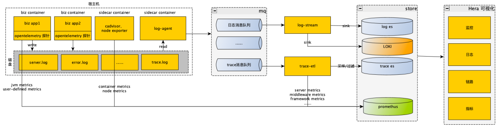

# HERA说明文档
## 命名解释
Hera是希腊神话中的女神，也是宙斯的妻子和天后。她是家庭、婚姻、生育和女性的守护神。她通常被描绘为一位美丽、高大、威严的女性，头戴皇冠，手持权杖和皇家权力的象征。她的神庙和祭坛遍布希腊和罗马帝国的领土，是古代希腊文化中最重要的女神之一。

---

## HERA是什么？
HERA是由中国区研发效能团队开源的一款应用性能观测平台(APM)。以应用为核心，集指标监控、链路追踪、日志、报警于一身，并实现了metrics->tracing->logging的串联和联动，hera还提供应用健康状态列表、应用指标看板、接口大盘、应用大盘、网关大盘等内容丰富的监测看板，以及简洁明了的可视化明文报警，让用户准确、高效定位故障。

---

## Architecture

---

## Features
- 准：基于业务错误码提取可用性指标
- 快：metrics-tracing-logging联动
- 经济：<5%存储成本，满足99.9%的tracing诉求
- 拥抱云原生：遵循Opentracing标准、深度适配K8S、集成集成Opentelemetry、Grafana、Prometheus、ES等多个开源明星产品
- 企业级可观测产品

---

## Getting started
### 部署
[operator使用文档.md](readme%2Fdeploy%2Fhera-deploy-document.md)

---

### 应用接入
[应用接入文档.md](readme/application-integeration/application-integration-document.md)

---
