# Hera接入文档

## 一、应用部署的依赖
接入Hera的应用，需要依赖探针、jvm参数、环境变量以及log-agent服务

### 1、探针
探针在构建完成后最终会得到一个opentelemetry相关的jar，我们需要在部署项目时，将jar文件放到服务器上。这是为了在jvm参数中，能够通过-javaagent使用到探针。我们基于开源版本默认打包了一版探针，可以直接使用：


### 2、jvm参数

先取用户主动设置的，为空取Nacos中DataId为`hera_javaagent_config`中配置的值，为空则设置默认值。必填项需要用户手动设置，不设置可能会导致探针无法生效。

| 变量名                                                     | 是否必填 | 默认值      | 备注                                                                                   |
| ---------------------------------------------------------- | -------- | ----------- | -------------------------------------------------------------------------------------- |
| -javaagent:/opt/soft/opentelemetry-javaagent-all-0.0.1.jar  | 是       |             | 用于表示javaagent探针jar包在服务器上的位置，<br/>我们一般习惯将探针的jar文件更名为opentelemetry-javaagent-all-0.0.1.jar，并放在服务器/opt/soft目录下。 |
| -Dotel.exporter.prometheus.nacos.addr=${nacosurl}           | 是       |             | Nacos地址                                                                             |
| -Dotel.resource.attributes=service.name=1-test              | 否       | none        | 用于表示当前服务的应用名。格式是appId-appName。eg：1-test，1是 appId，test是appName。<br/>如果为空，程序⾥默认使⽤none。应⽤是Hera中⾮常重要的元数据，可观测数据展⽰都与应⽤有关。 |
| -Dotel.traces.exporter=log4j2                              | 否       | log4j2      | 用于表示trace export方式，是通过log4j2将trace输出到日志文件中，默认使用log4j2           |
| -Dotel.exporter.log.isasync=true                            | 否       | true        | 用于表示是否开log4j2启异步日志，一般出于性能考虑，会是true                             |
| -Dotel.metrics.exporter=prometheus                          | 否       | prometheus  | 用于表示metrics export方式。默认使用prometheus                                       |
| -Dotel.javaagent.exclude-classes=com.dianping.cat.*          | 否       | com.dianping.cat.* | 过滤不被探针拦截的包。如果使用到了cat，需要将cat所在的目录进行过滤                  |
| -Dotel.exporter.log.pathprefix=/home/work/log/              | 否       | /home/work/log/ | 用于表示log4j2的日志位置。<br/>这里log4j2的日志会优先输出到名为MIONE_LOG_PATH的环境变量所表示的位置，如果没有这个环境变量，则会输出到-Dotel.exporter.log.pathprefix \ -Dotel.resource.attributes=service.name目录下。<br/>注意：k8s中，需要将此目录挂载出来，以供日志采集容器能够访问到。 |
| -Dotel.propagators=tracecontext                             | 否       | tracecontext | 用于表示trace传输的处理类型，目前只用到了tracecontext                                |


### 3、环境变量

先取用户主动设置的，为空取Nacos中DataId为`hera_javaagent_config`中配置的值，为空则设置默认值。必填项需要用户手动设置，不设置可能会导致探针无法生效。

| 变量名                 | 是否必填 | 默认值 | 备注                                                                                                       |
|------------------------|--------|--------|------------------------------------------------------------------------------------------------------------|
| MIONE_PROJECT_ENV_NAME  | 是     | default | 当前部署环境的名称，eg：dev、uat、st、preview、production。如不填，默认使用default。                               |
| MIONE_PROJECT_ENV_ID    | 是     |        | 当前部署环境的ID。环境id与环境名称，在Hera的指标监控中可以根据不同环境来看监控图表。                                       |
| MIONE_PROJECT_NAME      | 是     | none   | 用于表示当前服务的应用名。格式是appId-appName。eg：1-test，1是 appId，test是appName。如果为空，程序⾥默认使⽤none。应⽤是Hera中⾮常重要的元数据，可观测数据展⽰都与应⽤有关。 |
| host.ip                | 否     |        | 用于记录当前物理机IP，展示在trace的process.tags里。在k8s里获取的是pod的IP。在K8s中，使用hera-operator部署时，会由webhook自动生成该环境变量            |
| node.ip                | 否     |        | 用于记录k8s当前node节点的IP，非k8s部署则不用设置。在K8s中，使用hera-operator部署时，会由webhook自动生成该环境变量                                  |
| JAVAAGENT_PROMETHEUS_PORT | 否     | 55433  | 当前物理机可用端口号，用于提供给Prometheus拉取jvm metrics的httpServer使用。如果为空，程序里默认使用55433。                              |
| hera.buildin.k8s       | 否     | 1      | 用于记录是否是k8s部署的服务，如果是k8s的服务，标记为1。如果非k8s部署，可以设置为2。默认为1。如果本地调试，可以设置2。                                      |
| application            | 否     |        | 是将-Dotel.resource.attributes=service.name=的值所有中划线，转为下划线，用于容器监控的扩展指。在K8s中，使用hera-operator部署时，会由webhook自动生成该环境变量     |
| serverEnv              | 否     |        | 与MIONE_PROJECT_ENV_NAME的值相同，用于容器监控的扩展指标。在K8s中，使用hera-operator部署时，会由webhook自动生成该环境变量                          |

### 4、log-agent
目前Hera的trace、log都使用log-agent来收集，log-agent需要以sidecar的方式与应用部署在同一容器中，并且需要被采集的日志文件目录与trace日志目录同时挂载出来，以能够被log-agent采集。

### 5、应用Dockerfile与K8S yaml文件示例
下面是我们demo项目所使用的dockerfile与k8s的yaml文件，可以参考一下hera-demo-client应用中关于探针、jvm、环境变量与log-agent的配置

Dockerfile
```
FROM openjdk:8-jre

COPY ./hera-demo-client-1.0.0-SNAPSHOT.jar /home/work/hera-demo-client-1.0.0-SNAPSHOT.jar
COPY ./opentelemetry-javaagent-0.1.0-SNAPSHOT-all.jar /opt/soft/opentelemetry-javaagent-0.1.0-SNAPSHOT-all.jar

ENTRYPOINT ["java","-javaagent:/opt/soft/opentelemetry-javaagent-0.1.0-SNAPSHOT-all.jar","-Dotel.exporter.prometheus.nacos.addr=nacos:80","-Xloggc:/home/work/log/gc.log","-Duser.timezone=Asia/Shanghai","-XX:+HeapDumpOnOutOfMemoryError","-XX:HeapDumpPath=/home/dum/oom.dump","-jar","/home/work/hera-demo-client-1.0.0-SNAPSHOT.jar","&&","tail","-f","/dev/null"]
```
K8S yaml

```
apiVersion: apps/v1
kind: Deployment
metadata:
  name: hera-demo-client
  namespace: demo
  labels:
    app: hera-demo-client
spec:
  replicas: 1
  selector:
    matchLabels:
      app: hera-demo-client
  template:
    metadata:
      labels:
        app: hera-demo-client
    spec:
      containers:
      - name: hera-demo-client-container
        image: demo/hera-demo-client:v1
        env:
          - name: MIONE_PROJECT_ENV_NAME
            value: dev
          - name: MIONE_PROJECT_ENV_ID
            value: '2'
          - name: MIONE_PROJECT_NAME
            value: 2-hera-demo-client
        volumeMounts:
          - name: log-path
            mountPath: /home/work/log
        resources:
          limits:
            cpu: '500m'
            memory: 2Gi

      - name: log-agent
        image: demo/log-agent:v1
        volumeMounts:
        - mountPath: "/home/work/log"
          name: log-path
        resources:
          limits:
            cpu: '300m'
            memory: 1Gi
      volumes:
      - name: log-path
        emptyDir: {}
```

## 录入TPC

Hera通过TPC系统来录入、同步、管理应用的元数据信息，以及应用与人的权限关系

### 1、注册并登录tpc

我们需要访问通过hera-operator生成的tpc的页面链接


未登录访问时，会跳转到tpc登录页面，如果是第一次访问，我们需要先注册tpc超级管理员账号，该账号用于创建项目、授权等操作。超级管理员账号名必须为：tpc@tpc.com，密码可以自定义。注册完成后，我们使用tpc@tpc.com进行登录。


### 2、录入应用

登录成功后，就进入了tpc的首页。在tpc首页的节点信息--子节点中，默认会创建一个名为hera的节点，这个节点是项目组，接入Hera的应用需要先在这个项目组下维护应用信息。

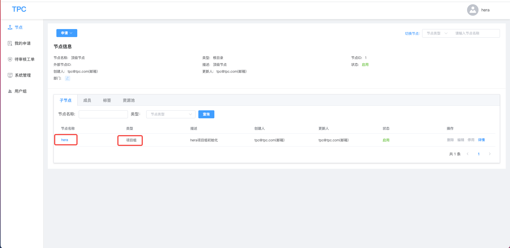

点击hera节点，进入hera项目组中。hera项目组中默认会创建logger项目，这个项目是用于Hera日志中，我们可以忽略。点击图中标注的“添加”按钮，会弹出创建项目的弹框。

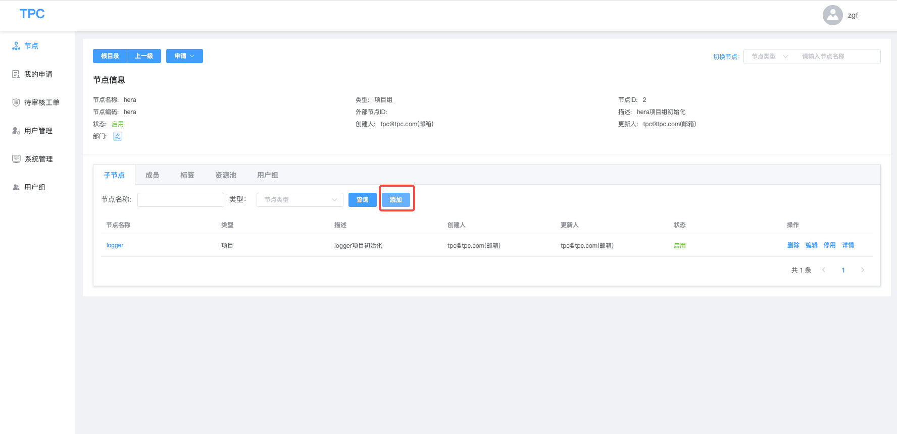

节点类型选择“项目”，节点名称就填写我们的应用名称，管理员就填写当前应用的成员账号，当然，这个账号需要提前在tpc上注册。
我们录入应用信息时，需要分两种情况：

一是，我们目前已经有了应用的数据，并且应用的数据中有id，此时我们可以通过在tpc维护外部节点id，来将我们已有的应用id录入。这里我使用之前“一、应用部署的依赖”中的“应用Dockerfile与K8s yaml文件示例”中的应用来进行录入，如下图所示：


二是，我们目前只有应用的名称，但是没有应用的id，此时我们不需要填写“外部节点类型”与“外部节点ID”，tpc在创建应用之后，会自动生成该应用的id，点击该应用节点详情按钮，在该应用“节点信息”中，我们可以看到该应用的id。如下图所示：


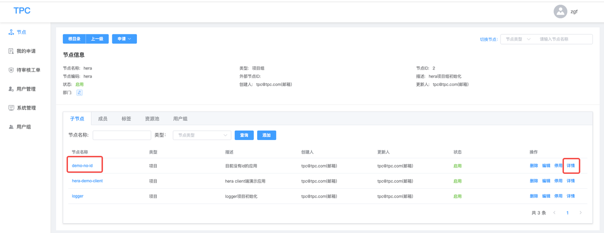

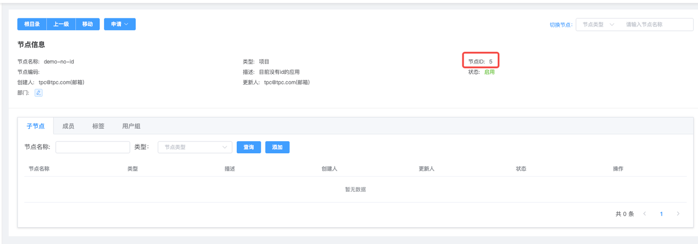

不管是哪种情况，注意这里的应用id与应用名称，都要与应用部署中的jvm参数：`-Dotel.resource.attributes=service.name`或者是环境变量中的`MIONE_PROJECT_NAME`保持一致。

### 3、应用与人的权限

如果我们想给某一个应用添加管理员，让他可以在hera上有配置该应用的权限，我们可以在tpc中找到这个应用，点击应用名称，进入节点详情，在该应用节点的“成员”标签页中，点击添加按钮，可以选择将某个人的账号添加为管理员

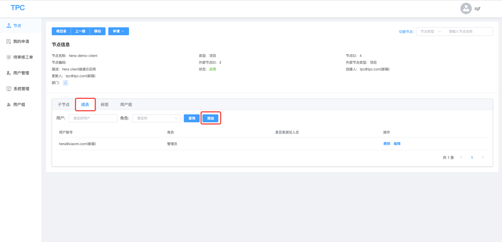

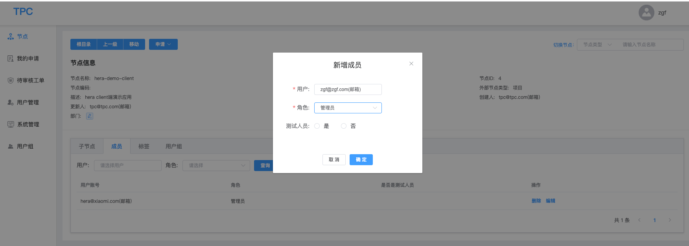

## 配置日志采集

由于Hera中的日志、trace数据都是由log-agent采集，所以我们需要在Hera日志配置中配置采集信息，告诉log-agent去哪采集，以及采集后发送给谁。

### 1、访问Hera日志页面

我们通过访问operator生成的hera首页的链接，在首页头部title中，点击“日志服务”，进入Hera日志的界面。

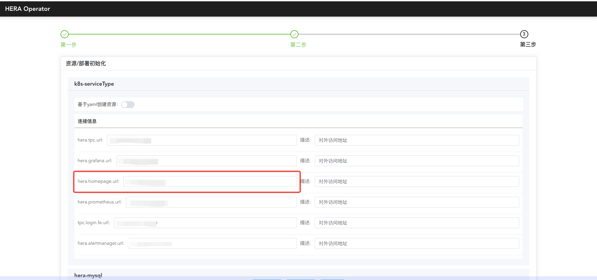

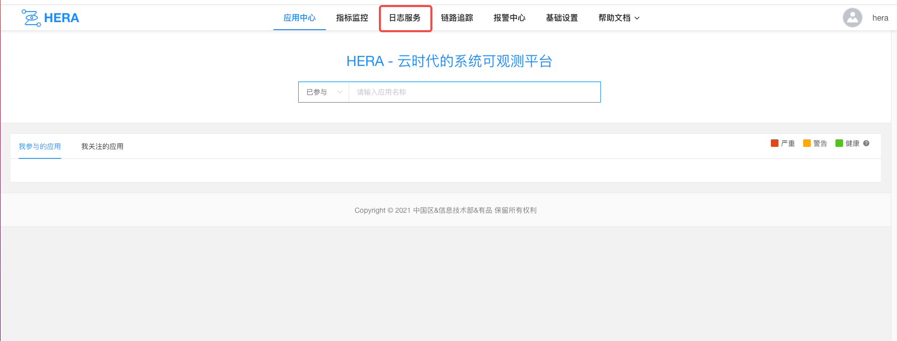

### 2、配置日志资源（后续会自动创建默认资源）

在日志页面左侧菜单栏，点击资源管理，填写RocketMQ与ES资源信息。

#### （1）RocketMQ
    别名：RocketMQ资源别名，可以自定义

    区域：选择“大陆机房”

    mq地址：RocketMQ的地址，格式为host:port

    mq域名：RocketMQ地址的域名

    ak：RocketMQ的accessKey，没有可不填

    sk：RocketMQ的secretKey，没有可不填

    brokerName：填写RocketMQ的brokerName，可以在RocketMQ的dashboard中查看，目的是为了创建日志所需要的topic，默认的为broker-0

    标签列表：RocketMQ的tag列表，没有可不填


#### 2）ES
    别名：ES资源别名，可以自定义

    区域：选择“大陆机房”

    es集群名称：同别名

    esApi地址：ES的地址，格式为host:port

    连接方式：选择连接ES的方式，分为“用户名和密码”与“Token”，用户名、密码、Token没有可以不填

    标签列表：没有可不填

    es索引组：我们会为每种日志类型默认创建一个索引组，但是需要用户将这四个索引组进行分别配置：
        多行应用日志：mione_hera_log_multiple_app_log01
        单行应用日志：mione_hera_log_single_app_log01
        nginx日志：mione_hera_log_nginx_app_log01
        opentelemetry日志：mione_hera_log_other_app_log01


### 3、创建space

配置好资源后，我们需要创建space--store--taill这三个配置。
首先，在hera日志服务首页中，点击“立即接入”，进入日志接入页面。点击空间Space右侧的立即创建，创建一个Space。Space一般是部门组织级别。

注意：创建Space后，需要去tpc上hera--logger下对应的space节点下进行授权。


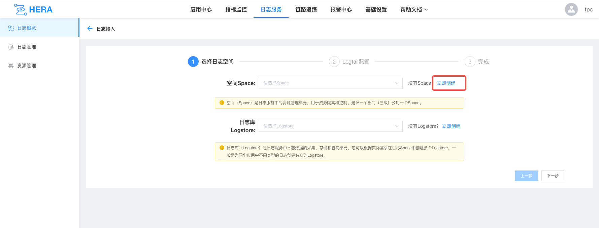


### 4、创建store

在创建Space后，我们在空间Space下拉框中选择刚刚创建的Space，点击日志库Logstore右侧的立即创建，创建store。

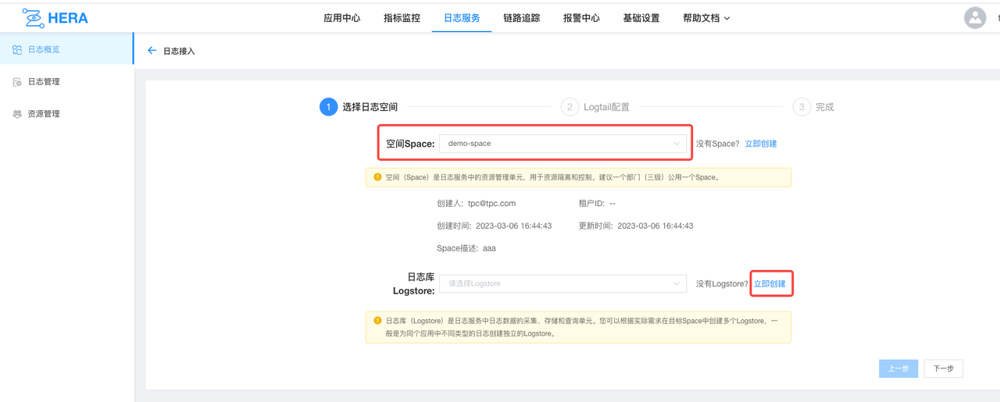


### 5、创建tail
    应用类型：选择hera

    部署方式：选择mione

    服务应用名：选择需要接入的应用名

    服务别名：可以自定义

    环境分组：选择需要接入的环境

    服务IP：选择环境后自动带出，需要进行勾选。如果没有，也可以手动进行添加

    日志文件目录：应用日志文件的输出位置，具体到文件名

    切分表达式：日志文件切分的命名规则
        如果日志切分后和当前目录不在一起，且切分后的文件名的前缀不是日志为名的，则要自己手动填写切分表达式，例如：/home/work/logs/applogs/old/shopapi_application.log-.*。否则可不填。
        行首正则表达式：如：^2022-* .*$
        日志解析类型：分割符、自定义、正则、json、nginx
        解析脚本：
        分割符：每一段是怎么分割的，输入分割你日志的分割符
        自定义：如果是比较复杂的，可能每一部分都分割都不一样，则用自定义，例如：[%s]-[%s]-[%s]-[%s]-[%s]-%s，会根据 %s 查找每一部分，每一部分的前缀和后缀
        正则：输入正则表达式，会根据捕获组来提取字段
        nginx：输入 nginx 日志格式配置，例如：
            log_format milog2  '$time_iso8601\t$msec\t$host\t$request_method\t$scheme\t$status\t'
            '$upstream_addr\t$upstream_cache_status\t$upstream_status\t'
            '$server_addr\t$remote_addr\t$http_x_forwarded_for\t'
            '$request_length\t$request_time\t$bytes_sent\t$upstream_response_time\t'
            '$upstream_connect_time\t $upstream_header_time\t$upstream_response_length\t$upstream_bytes_received\t'
            '$request_uri\t"$http_user_agent"\t'
            '$sent_http_x_xiaomi_error_code';

    收集速率：日志采集时多长时间发送一次，控制发送的速率

    MQ配置：可不填，默认会将日志消息随机发送至某一个topic中

    索引列：日志每一部分代表的含义，这个是从当前 store 中选择的，且顺序必须和日志中实际的日志中字段各部分的含义对应。store 的索引列必须是最多的，避免 tail 选择时没有.


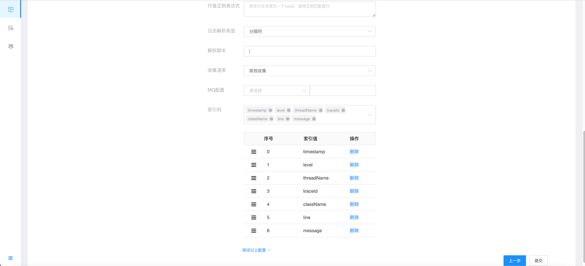

配置完成后，等待几秒钟的时间，就可以在日志页面查看日志了。

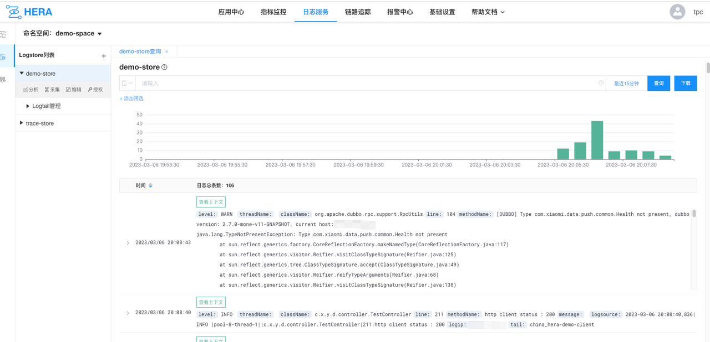

### 6、配置trace采集（后续可以自动创建）

在Hera中，trace信息是通过Hera日志中的log-agent进行收集的，我们是把trace信息当做是一种特殊的日志进行采集，所以还需要在Hera日志上配置trace的采集信息。只需要按照以下配置即可。

#### （1）创建trace-space

