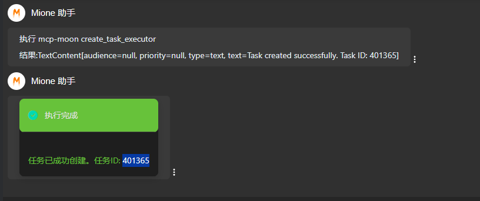

```json
{
  "mcpServers": {
    "mcp-moon":{
      "command": "D:\\software\\jdk21\\bin\\java.exe",
      "args": [
        "-jar",
        "-Ddubbo.application.service-discovery.migration=APPLICATION_FIRST",
        "D:\\workspace\\xiaomiMone\\jcommon\\mcp\\mcp-moon\\target\\app.jar"
      ]
    }
  }
}
```

####创建任务：
帮我在中国区362207系统中创建一个名为moon-mcp4 http类型的任务 url为​https://baidu.com/44 提交方式为get




####模仿创建任务：
模仿401361创建任务  dubbo provider为： run.mone.moon.function.MoonQueryFunction 方法为： apply

模仿duminchao最后创建的一条任务， 创建 url 为https://baidu.com 提交方式为post的任务

####查询任务：
帮我查询 run.mone.moon.function.MoonQueryFunction的

帮我查询duminchao最近创建的一条任务
帮我查询

