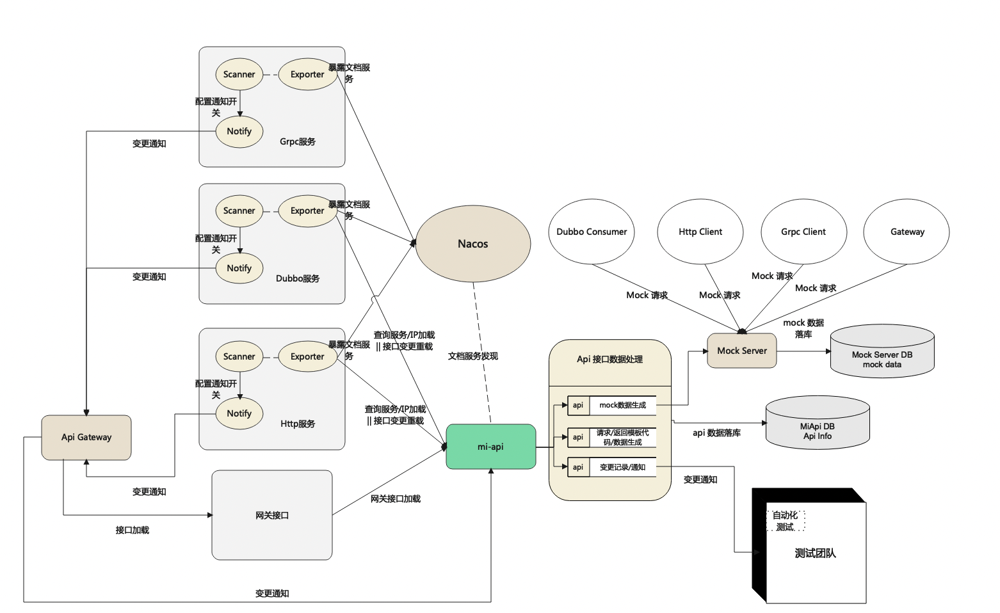

# MiApi：多协议接口管理测试平台
## 它有什么作用
用于多种协议类型如Http、Dubbo、Grpc等接口的文档生成与管理，以及接口测试、Mock、团队文档维护等。
## 整体架构

## 快速开始
### 部署方式
**MiApi主要由三部分组成**：
（项目代码地址：https://github.com/XiaoMi/mone）

git clone https://github.com/XiaoMi/mone

####  dashboard项目
Dashboard 前后端分离，为mi-api与mi-api-fe
- mi-api
  项目后端代码，项目中使用了springboot、mysql、redis、nacos等。位于上述项目地址下的mi-api文件夹下。
- 初始化数据库
  使用 mi-api/mi-api-server/src/main/resources/sql/init.sql  路径下的sql文件初始化创建数据库。
- 添加配置
  根据本地或公司内搭建的mysql、redis、nacos等地址配置添加到application.config中：
```
spring.datasource.url=jdbc:mysql://127.0.0.1:3079/{database_name}?characterEncoding=UTF-8
spring.datasource.username=xxx
spring.datasource.password=xxx
redis.host=xxx
redis.port=6379
redis.password=xxx
//nacos地址
dubbo.registry.address.st=nacos://127.0.0.1:8848
dubbo.registry.address.ol=nacos://127.0.0.1:8848


//若配置存在nacos中则配置相应dataid
nacos.config.data.id

//mock服务器部署完成后，配置mock服务器地址
mock.server.addr=http://127.0.0.1:8080
mock.server.mock.addr=http://127.0.0.1:8080
```

配置完成后通过启动类 MiApiBootstrap 可直接运行。
- mi-api-fe  前端项目
  项目环境： node/10.24.1、npm/6.14.5、@vue/cli 4.5.15
  部分CodeMirror规则需要手动在html页面中引入public/jshint/jshint.js与public/jshint/jsonlint.js
```  // 安装依赖
  npm i
  // 本地服务
  npm run serve
  // 编译打包 部署dist文件夹
  npm run build


// 本地接口代理 vue.config.js
devServer: {
compress: true,
disableHostCheck: true,
proxy: {
'^/api': {
target: 'http://后端IP:端口',
changeOrigin: true, // 允许跨域
pathRewrite: {
'^/api': ''
}
}
}
}
```
- mock数据服务器 mock-server
  该项目用于接口获取mock数据。
    - 初始化数据库
      根据 mock_server/mock-server-server/src/main/resources/sql/init.sql 路径下的sql文件初始化创建数据库。
    - 配置
      该项目只需配置上述创建完成的数据库相关信息即可，在config.properties中配置：
      server.port=${server.port}
      db_pwd=${db_pwd}
      db_url=${db_url}
      db_user_name=${db_user_name}
      db_pool_size=${db_pool_size}


配置完成后，通过启动类 MockServerBootstrap 中可直接运行项目。
- 注解依赖项目 dubbo-mone
  该项目无需部署，只需在业务项目中引入使用即可。

源码
git clone https://github.com/XiaoMi/mone
以上项目目录下的mi-api、mi-api-fe、mock-server、dubbo-mone