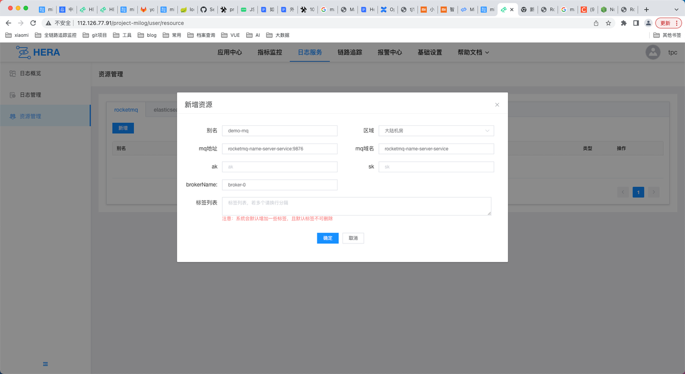
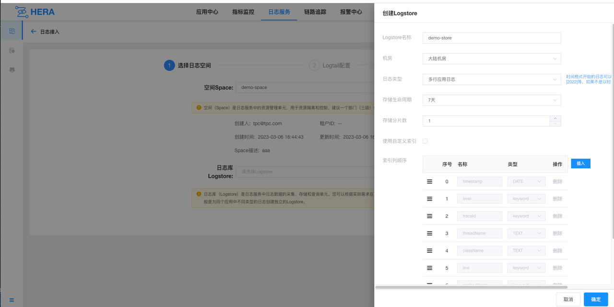

# OzHera Integration Documentation

## I. Dependencies for Application Deployment

Applications integrating with OzHera require probes, JVM parameters, environment variables, and the log-agent service.

### 1. Probes

Upon completion of the probe build, a jar related to opentelemetry will be generated. When deploying the project, this
jar file should be placed on the server. This allows the probe to be utilized in the JVM parameters through
the `-javaagent`. We have packaged a default version of the probe based on the open-source version, which can be used
directly.

### 2. JVM Parameters

First, take the user-defined value. If it's empty, take the value configured in Nacos with DataId
as `hera_javaagent_config`. If that's empty too, set the default value. Mandatory items need to be set by the user
manually; failure to set might cause the probe to be ineffective.

| Variables                                                  | Mandatory indicators | Default values     | Comments                                                                                                                                                                                                                                                                                                                                                                                                                      |
|------------------------------------------------------------|:--------------------:|--------------------|-------------------------------------------------------------------------------------------------------------------------------------------------------------------------------------------------------------------------------------------------------------------------------------------------------------------------------------------------------------------------------------------------------------------------------|
| -javaagent:/opt/soft/opentelemetry-javaagent-all-0.0.1.jar |         true         |                    | Used to indicate the location of the javaagent probe jar package on the server, <br/> we usually rename the probe's jar file to opentelemetry-javaagent-all-0.0.1.jar and place it in the /opt/soft directory on the server.                                                                                                                                                                                                  |
| -Dotel.exporter.prometheus.nacos.addr=${nacosurl}          |         true         |                    | Nacos address                                                                                                                                                                                                                                                                                                                                                                                                                 |
| -Dotel.resource.attributes=service.name=1-test             |        false         | none               | Used to represent the application name of the current service. The format is appId-appName. For example: 1-test, where "1" is the appId and "test" is the appName. <br/> If it is empty, the default used in the program is "none". The application is a very important piece of metadata in OzHera, and observable data presentations are all related to the application.                                                      |
| -Dotel.traces.exporter=log4j2                              |        false         | log4j2             | Used to indicate the trace export method, which is to output the trace to log files via log4j2. The default is to use log4j2.                                                                                                                                                                                                                                                                                                 |
| -Dotel.exporter.log.isasync=true                           |        false         | true               | Used to indicate whether to enable asynchronous logging with log4j2. Generally, for performance reasons, it would be set to "true". It only takes effect when the value of `-Dotel.traces.exporter` is `log4j2`.                                                                                                                                                                                                              |
| -Dotel.metrics.exporter=prometheus                         |        false         | prometheus         | Used to indicate the metrics export method. The default is to use Prometheus.                                                                                                                                                                                                                                                                                                                                                 |
| -Dotel.javaagent.exclude-classes=com.dianping.cat.*        |        false         | com.dianping.cat.* | Used to filter packages that are not intercepted by the probe. If you are using "cat", you need to filter out the directory where "cat" resides.                                                                                                                                                                                                                                                                              |
| -Dotel.exporter.log.pathprefix=/home/work/log/             |        false         | /home/work/log/    | Used to indicate the location of log4j2 logs.</br> Here, the log4j2 logs will be outputted to the location represented by the environment variable named MIONE_LOG_PATH. If this environment variable does not exist, it will be outputted to the `-Dotel.exporter.log.pathprefix` \ `MIONE_PROJECT_NAME` directory.<br/>Note: In k8s, this directory needs to be mounted so that the log collection container can access it. |
| -Dotel.propagators=tracecontext                            |        false         | tracecontext       | Used to indicate the processing type for trace transmission. Currently, only "tracecontext" has been used.                                                                                                                                                                                                                                                                                                                    |

### 3. Environment Variables

Similar to the JVM parameters, first take the user-defined value. If it's empty, take the value from Nacos with DataId
as `hera_javaagent_config`. If that's empty, then set to the default value. Mandatory items need to be set manually;
failure to set might cause the probe to be ineffective.

| Variables                 | Mandatory indicators | Default values | Comments                                                                                                       |
|---------------------------|:--------------------:|----------------|----------------------------------------------------------------------------------------------------------------|
| MIONE_PROJECT_ENV_NAME    |         true         | default        | Name of the current deployment environment, e.g., dev, uat, st, preview, production. If not provided, 'default' is used by default.                                                   |
| MIONE_PROJECT_ENV_ID      |         true         |                | ID of the current deployment environment. The environment id and environment name can be used in OzHera's metric monitoring to view monitoring charts based on different environments.                                                                 |
| MIONE_PROJECT_NAME        |         true         | none           | Represents the current service's application name. The format is appId-appName. E.g., 1-test, where 1 is the appId, and test is the appName. If left empty, 'none' is used by default in the program. Applications are a crucial metadata in OzHera, and all observability data displays are related to the application. |
| host.ip                   |        false         |                | Used to record the current physical machine IP, displayed in the trace's process.tags. In k8s, it retrieves the pod's IP. In K8s, when deploying using the ozhera-operator, this environment variable is auto-generated by the webhook.               |
| node.ip                   |        false         |                | Used to record the IP of the current node in k8s; if not deployed in k8s, there's no need to set this. In K8s, when deploying using the ozhera-operator, this environment variable is auto-generated by the webhook.                                   |
| JAVAAGENT_PROMETHEUS_PORT |        false         | 55433          | The available port number of the current physical machine, used by the httpServer that provides Prometheus to pull jvm metrics. If left empty, the program defaults to using 55433.                                        |
| hera.buildin.k8s          |        false         | 1              | Used to record whether the service is deployed in k8s. If the service is in k8s, it's marked as 1. If not deployed in k8s, it can be set to 2. The default is 1. If debugging locally, you can set it to 2.                                              |
| application               |        false         |                | Converts all hyphens in the `MIONE_PROJECT_NAME` value to underscores, used for container monitoring's extended metrics. In K8s, when deploying using the ozhera-operator, this environment variable is auto-generated by the webhook.                   |
| serverEnv                 |        false         |                | The value is the same as MIONE_PROJECT_ENV_NAME, used for the extended metrics in container monitoring. In K8s, when deploying using the ozhera-operator, this environment variable is auto-generated by the webhook.                          |

### 4、log-agent

Currently, OzHera uses the log-agent to collect both trace and log. The log-agent should be deployed as a sidecar along
with the application in the same container. Additionally, the directories for logs to be collected and trace logs should
both be mounted, enabling the log-agent to access them.

### 5. Sample Application Dockerfile and K8S yaml Files

The Dockerfile and K8S yaml file used in our demo project are presented below. These can be referenced for probe, JVM,
environment variables, and log-agent configurations in the ozhera-demo-client application.

Dockerfile

```
FROM openjdk:8-jre

COPY ./ozhera-demo-client-1.0.0-SNAPSHOT.jar /home/work/ozhera-demo-client-1.0.0-SNAPSHOT.jar
COPY ./opentelemetry-javaagent-0.1.0-SNAPSHOT-all.jar /opt/soft/opentelemetry-javaagent-0.1.0-SNAPSHOT-all.jar

ENTRYPOINT ["java","-javaagent:/opt/soft/opentelemetry-javaagent-0.1.0-SNAPSHOT-all.jar","-Dotel.exporter.prometheus.nacos.addr=nacos:80",
"-Xloggc:/home/work/log/gc.log","-Duser.timezone=Asia/Shanghai","-XX:+HeapDumpOnOutOfMemoryError","-XX:HeapDumpPath=/home/dum/oom.dump","-jar",
"/home/work/ozhera-demo-client-1.0.0-SNAPSHOT.jar","&&","tail","-f","/dev/null"]
```

K8S yaml

```
apiVersion: apps/v1
kind: Deployment
metadata:
  name: ozhera-demo-client
  namespace: demo
  labels:
    app: ozhera-demo-client
spec:
  replicas: 1
  selector:
    matchLabels:
      app: ozhera-demo-client
  template:
    metadata:
      labels:
        app: ozhera-demo-client
    spec:
      containers:
      - name: ozhera-demo-client-container
        image: demo/ozhera-demo-client:v1
        env:
          - name: MIONE_PROJECT_ENV_NAME
            value: dev
          - name: MIONE_PROJECT_ENV_ID
            value: '2'
          - name: MIONE_PROJECT_NAME
            value: 2-ozhera-demo-client
        volumeMounts:
          - name: log-path
            mountPath: /home/work/log
        resources:
          limits:
            cpu: '500m'
            memory: 2Gi

      - name: log-agent
        image: demo/log-agent:v1
        volumeMounts:
        - mountPath: "/home/work/log"
          name: log-path
        resources:
          limits:
            cpu: '300m'
            memory: 1Gi
      volumes:
      - name: log-path
        emptyDir: {}
```

## Input into TPC

OzHera uses the TPC system to input, sync, and manage application metadata information, as well as relationships between
applications and users.

### 1. Registration and Login to TPC

One needs to visit the TPC page link generated through the ozhera-operator.


When accessing without logging in, it redirects to the TPC login page. If it's the first visit, we need to register the
TPC super admin account. This account is used for creating projects and authorizations. The super admin username must
be: tpc@tpc.com. The password can be customized. After registration, we log in using tpc@tpc.com.


### 2. Enter Application Information

After successful login, you'll land on the TPC homepage. Under the node information on the TPC homepage's sub-node, a
node named 'hera' will be created by default. This node represents a project group. To integrate with OzHera, one must
first maintain the application information under this project group.


Clicking on the OzHera node takes us into the OzHera project group. By default, a logger project will be created within the
OzHera project group, which is used in OzHera logs and can be ignored. Clicking the "Add" button highlighted in the image
will pop up a dialog box to create a new project.


Select the node type as "Project", enter the name of our application for the node name, and enter the account of the
current application member as the admin. Of course, this account needs to be registered on TPC in advance. When entering
application information, there are two scenarios:

- First, if we already have application data, and there's an id in the application data, we can enter our existing
  application id by maintaining the external node id on TPC. Here, I use the application from the previous section "I.
  Application Deployment Dependencies" under "Application Dockerfile & K8S yaml file examples" for entry, as shown
  below:


- Second, if we only have the name of the application but no application id, we don't need to fill in the "External Node
  Type" and "External Node ID". After TPC creates the application, it will automatically generate an id for this
  application. Click on the application node detail button, and in the application "Node Information", we can see the id
  of the application, as shown below:


Regardless of the scenario, note that both the application id and application name must be consistent with the JVM
parameters `-Dotel.resource.attributes=service.name` or the environment variable `MIONE_PROJECT_NAME`.

### 3. Application and User Permissions

If we want to add an admin to a particular application, allowing them to have the permissions to configure that
application on OzHera, we can find the application in TPC, click on the application name, enter the node details, and in
the "Members" tab of the application node, click the add button. This allows us to add someone's account as an admin.


## Configuring Log Collection

Since logs and trace data in OzHera are collected by log-agent, we need to configure collection information in OzHera log
settings, instructing the log-agent where to collect and where to send the data after collection.

### 1. Accessing OzHera Logging Page

We access the ozhera homepage link generated by the operator, and in the homepage title, click "Logging Service" to
enter the OzHera logging interface.


### 2. Configuring Logging Resources (default resources will be automatically created later)

In the logging page sidebar, click on Resource Management and fill in the RocketMQ and ES resource details.

#### (1) RocketMQ

- Alias: Alias for RocketMQ resources, can be customized
- Region: Choose "Mainland Data Center"
- MQ Address: The address of RocketMQ, formatted as host:port
- MQ Domain: Domain name of the RocketMQ address
- AK: RocketMQ's accessKey, if none, leave blank
- SK: RocketMQ's secretKey, if none, leave blank
- BrokerName: Enter the brokerName of RocketMQ, which can be viewed in the RocketMQ dashboard. The purpose is to create
  the required topic for logs, the default is broker-0
- Tag List: List of tags for RocketMQ, if none, leave blank



#### (2) ES

- Alias: Alias for ES resources, can be customized
- Region: Choose "Mainland Data Center"
- ES Cluster Name: Same as Alias
- ES API Address: Address of ES, formatted as host:port
- Connection Method: Choose the method to connect to ES, either "Username and Password" or "Token". If none for
  username, password, and token, leave blank.
- Tag List: If none, leave blank
- ES Index Group: An index group will be created by default for each log type, but users need to configure these four
  index groups separately:
    - Multi-line Application Log: mione_hera_log_multiple_app_log01
    - Single-line Application Log: mione_hera_log_single_app_log01
    - Nginx Log: mione_hera_log_nginx_app_log01
    - Opentelemetry Log: mione_hera_log_other_app_log01


### 3. Creating Space

After configuring the resources, we need to create the configurations for space, store, and tail. Firstly, on the OzHera
logging service homepage, click "Immediate Access", and it leads to the logging access page. Click on the "Create"
option next to Space to create a new space. A Space is generally at the department or organizational level.

Note: After creating a Space, one needs to authorize it under the hera-logger space node on TPC.


### 4. Creating Store

After creating Space, select the newly created Space from the drop-down menu under Space. Click on the "Create" option
next to Logstore to create a store.




### 5. Creating Tail

- Application Type: Choose OzHera
- Deployment Method: Choose Mione
- Service Application Name: Choose the application to be integrated
- Service Alias: Can be customized
- Environment Group: Choose the environment to be integrated
- Service IP: It's automatically populated after choosing the environment and needs to be selected. If not available, it
  can be added manually.
- Log File Directory: Output location of the application log file, specific to the filename.
- Split Expression: Naming rule for log file splitting
    - If after splitting the log, it isn't in the current directory and the prefix of the split file's name isn't the
      log's name, one has to manually enter the split expression. For example:
      /home/work/logs/applogs/old/shopapi_application.log-.*. Otherwise, leave it blank.
    - Line Beginning Regular Expression: e.g., ^2022-* .*$
    - Log Parsing Type: Delimiter, Custom, Regular, JSON, Nginx
    - Parsing Script:
        - Delimiter: How each segment is split. Enter the delimiter that splits your log.
        - Custom: If it's more complex, where each part might have different splits, use Custom. For
          example: [%s]-[%s]-[%s]-[%s]-[%s]-%s. It will look for each segment based on %s, the prefix and suffix of each
          segment.
        - Regular: Enter a regular expression, extracting fields based on capture groups.
        - Nginx: Enter the Nginx log format configuration, for example:
          log_format milog2  '$time_iso8601\t$msec\t$host\t$request_method\t$scheme\t$status\t'
          '$upstream_addr\t$upstream_cache_status\t$upstream_status\t'
          '$server_addr\t$remote_addr\t$http_x_forwarded_for\t'
          '$request_length\t$request_time\t$bytes_sent\t$upstream_response_time\t'
          '$upstream_connect_time\t $upstream_header_time\t$upstream_response_length\t$upstream_bytes_received\t'
          '$request_uri\t"$http_user_agent"\t'
          '$sent_http_x_xiaomi_error_code';
    - Collection Rate: How often logs are sent during collection to control the sending rate.
    - MQ Configuration: Can be left blank. By default, the log message will be randomly sent to a topic.
    - Index Column: The meaning of each part of the log. This is selected from the current store, and the order must
      match the actual order of fields in the log. The index column of the store must be the most, to avoid not having a
      choice during tail selection.


Once the configuration is completed, after waiting for a few seconds, the logs can be viewed on the log page.


### 6. Configuring Trace Collection (can be automatically created later)

In OzHera, trace information is collected through log-agent in OzHera logs. We treat trace information as a special type of
log for collection, so trace collection information still needs to be configured on OzHera logs. Just follow the
configurations below.

#### (1) Create trace-space


#### (2) Create trace-store

For log type, choose "opentelemetry log". Other configurations can be left as default.


#### (3) Create trace-tail

Creating a tail for trace is similar to creating one for a regular application, but the configurations are more fixed.

- Service Application Name: Can only choose china_log-agent
- Service Group: Choose default_env
- Service IP: Select all
- Log File Path: Enter "/home/work/log/*/trace.log". It will scan and collect all trace.log files under /home/work/log.
- Collection Rate: Choose fast collection
- MQ Configuration: Choose the RocketMQ cluster configured in log resources. The following is to fill in the topic. If
  unchanged, it's fixed as: mone_hera_staging_trace_etl_server


## IV. Follow Applications on the Homepage

After adding applications to "Applications I'm Involved With" or "Applications I Follow" on the homepage, one can view
monitoring and linkage information.


