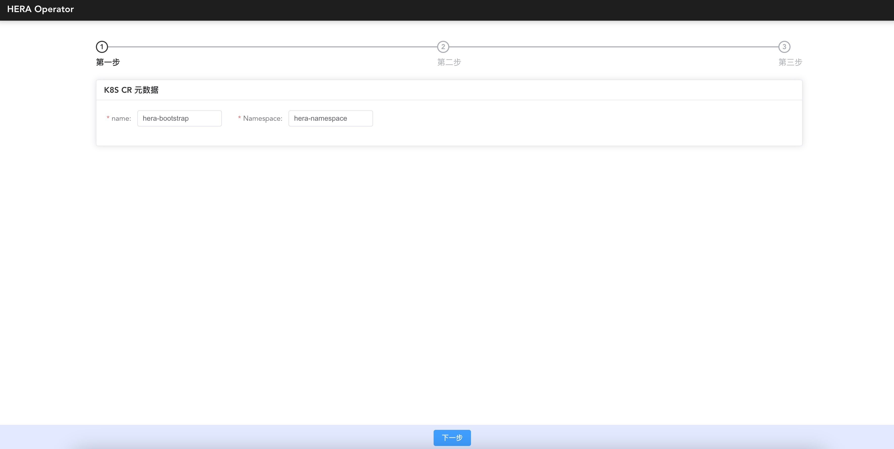

# OzHera Deployment Documentation

## 1. Deployment Instructions

The purpose of the OzHera operator is to launch an OzHera platform in a specified namespace in the k8s cluster. This documentation is suitable for R&D/operations staff with basic k8s knowledge (PV, PVC, Service, Pod, Deployment, DaemonSet, etc.).

OzHera is an enterprise-level observability platform with a very high complexity during deployment. Please read the following deployment documentation and related [operator introduction video](https://mp.weixin.qq.com/s?__biz=MzkwMjQzMzMxMg==&mid=2247483720&idx=1&sn=c38fca2d3e82de43ce22acad73a1be21&chksm=c0a4de07f7d35711c5cba634c3833708db19fcc9303a50b77f8c1601831cac8e9520e3f32ff5&token=1000658198&lang=zh_CN#rd) carefully before deployment.

## 2. Deployment Steps

ozhera-all/ozhera-operator/ozhera-operator-server/src/main/resources/operator/

### 2.1 Create a Separate Namespace and Account

- Execute the command to generate the auth yaml (by default, it will create a space: ozhera-namespace and account: admin-mone):

  `kubectl apply -f ozhera_operator_auth.yaml`

### 2.2 Create ozhera CRD

- Execute the command to generate the crd yaml:

  `kubectl apply -f ozhera_operator_crd.yaml`

### 2.3 Deploy operator

- Execute the command to deploy the operator:

  `kubectl apply -f ozhera_operator_deployment.yaml`

- Ensure that the deployed operator service port 7001 is externally accessible. The deployment of ozhera requires operations on the external page provided by the operator. In the default example, the LoadBalancer method is used to expose the externally accessible ip and port. If other methods are needed, modify the yaml yourself.

### 2.4 Operator Page Operations

#### 2.4.1 Access the operator page

If you use the LoadBalancer method in step 2.3, first find the external IP of the "ozhera-op-nginx" service. Execute the command:

`kubectl get service -n=ozhera-namespace`

Find the EXTERNAL-IP corresponding to ozhera-op-nginx. The default access address is: `http://EXTERNAL-IP:80/`

You will see the following interface:

#### 2.4.2 Operator metadata entry

- name: ozhera-bootstrap

  k8s custom resource name, keep the default value unchanged.

- Namespace: ozhera-namespace

  ozhera's independent space, it is recommended to keep ozhera-namespace unchanged. If changes are required, note the global change of the yaml.

#### 2.4.3 Confirm k8s access method

This step is to generate the access ip:port of the external page required in the ozhera platform. Currently, only the k8s LoadBalancer and NodePort methods are supported. By default, the LB mode will be tried first. If not supported, select NodePort (if the IP of NodePort is not open for external access, you need to set up a proxy separately, it is recommended that the cluster turn on LB).

Remember ozhera.homepage.url, after the ozhera cluster is built, the default access address is: http://${ozhera.homepage.url}

#### 2.4.4 Cluster Configuration

**Please do not modify k8s-serviceType**

##### OzHera-mysql

The purpose is to select a usable mysql database for ozhera.

- If you need k8s to automatically set up a database:

  Turn on the "Create resources based on yaml" button. The default yaml will create a pv for mysql data storage. If you use the default yaml, be sure to:
  1. Create a directory /opt/ozhera_pv/ozhera_mysql on the host machine node in advance (the directory can be changed, and this yaml is synchronized to modify);
  2. Find the name of the node where the directory was created (you can execute kubectl get node to confirm) and replace the value of cn-bxxx52 here;
  3. Ensure that the connection information is consistent with the information in the yaml, no modification is required by default.

- If you already have a database and don't need k8s to create it:
  1. Turn off the "Create resources based on yaml" button;
  2. Fill in the correct existing database url, username, and password;
  3. By default, the operator will automatically modify the database to create the ozhera database and table. **If the account you entered does not have permission to create a library or table, you need to manually create the ozhera database and table in the target library in advance.** The create table statement is in the operator source code ozhera-all/ozhera-operator/ozheraoperator-server/src/main/resources/ozhera_init/mysql/sql directory.

##### OzHera-es

The goal is to select an ES cluster available to OzHera and create the index template required by OzHera in ES.

- If you need k8s to automatically set up an ES:

  You need to turn on the "Create resources based on yaml" button. The default yaml-created ES has no account or password. If you need to set up an account or password, you need to:
  1. Modify xpack.security.enabled in the left yaml to true;
  2. Modify the values of ozhera.es.username and ozhera.es.password on the right "Connection Information", generally, we will use the elastic account, and the password needs to be set after the ES service is started;
  3. After starting ES, log in to the pod where ES is located, enter the /usr/share/elasticsearch/bin directory, execute the elasticsearchsetup-passwords interactive command, set the default account password for ES, note that the password set here must be consistent with the ozhera.es.password value on the page.

- If you already have ES, you don't need k8s to create it:
  1. Turn off the "Create resources based on yaml" button;
  2. Fill in the correct url, account, and password of the existing ES cluster;
  3. By default, the operator will automatically create the index template. **If the account you entered does not have permission to create an index template, you need to manually create the index template required by OzHera in advance**. OzHera's index template is stored in the operator source code run.mone.ozhera.operator.common.ESIndexConst in json format.

##### OzHera-rocketMQ

The purpose is to select a RocketMQ available for ozhera.

- If you need k8s to automatically set up a RocketMQ:
  1. You need to turn on the "Create resources based on yaml" button;
  2. The RocketMQ created by the default yaml has no accessKey or secretKey. If you need to set up accessKey or secretKey, you need to modify the values of ozhera.rocketmq.ak and ozhera.rocketmq.sk on the right "Connection Information";
  3. If you need to change the service of the RocketMQ broker, you need to replace the service in the yaml and the "brokerAddr" member variable value of the run.mone.ozhera.operator.service.RocketMQSerivce class in the ozoperator code.

- If you already have RocketMQ, you don't need k8s to set it up:
  1. Turn off the "Create resources based on yaml" button;
  2. Fill in the correct url, accessKey, and secretKey of the existing RocketMQ cluster;
  3. By default, the operator will automatically create the topics required by OzHera. **If the url, ak, and sk you entered do not have permission to create topics, or if the existing RocketMQ cluster does not allow topic creation through the API, you need to manually create the required topics in advance**. The topics required by OzHera are stored in the "topics" member variable of the run.mone.ozhera.operator.service.RocketMQSerivce class.

##### OzHera-redis

The goal is to select a Redis available for ozhera.

- If you need k8s to automatically set up a Redis:

  You need to turn on the "Create resources based on yaml" button. The default yaml-created redis has no password. If you need to set a password, you need to modify the value of ozhera.redis.password on the right to be consistent with the password set for redis.

- If you already have Redis, you don't need k8s to set it up:
  1. Turn off the "Create resources based on yaml" button;
  2. Fill in the correct URL and password of the existing Redis cluster.

##### OzHera-Nacos

It is the configuration and registration center inside the ozhera cluster. This cluster is recommended to use the yaml creation method. If the business needs to provide Nacos by itself, please provide the Nacos version 1.x first.

- If you need k8s to automatically set up a Nacos:

  You need to turn on the "Create resources based on yaml" button. Note that the image address, resource size configuration in the yaml, and the connection information on the right are consistent with the yaml.

- If you already have Nacos, you don't need k8s to create it:

  You need to turn off the "Create resources based on yaml" button and fill in the correct nacos connection information.

- Nacos configuration:

  The operator will default to initializing the listed configurations as nacos configurations. If the provided nacos is not created based on yaml, please confirm that the connection information has the right to call the config creation interface, otherwise, you need to manually create it in the target nacos in advance.

##### OzHera-Prometheus

The goal is to select a prometheus available for ozhera.

If you use the default yaml, be sure to:

- Create a directory /home/work/prometheus_ozhera_namespace_pv on the host machine node in advance;
- Find the name of the node where the directory was created (you can execute kubectl get node to confirm) and replace the cn- xxx here.

##### OzHera-Alertmanager

The goal is to select an alertmanager available for ozhera.

If you use the default yaml, be sure to:

- Create a directory /home/work/alertmanager_ozhera_namespace_pv on the host machine node in advance;
- Find the name of the node where the directory was created (you can execute kubectl get node to confirm) and replace the cn- here.

##### OzHera-Grafana

The goal is to select a grafana available for ozhera.

If you use the default yaml, be sure to:

- Create a directory /home/work/grafana_ozhera_namespace_pv on the host machine node in advance;
- Find the name of the node where the directory was created (you can execute kubectl get node to confirm) and replace the cn- beijingxxx here;
- The content of host, user, port, password, etc. configured in OzHera-mysql needs to be overridden in the corresponding db configuration of ozhera-grafana.

##### OzHera-Node-exporter

The goal is to select a node-exporter available for ozhera.

If you use the default yaml, be sure to:

- Find a usable port on the host machine in advance and fill it in the hostPort shown below. The default is 9101. After modification, update the content of mione.k8s.node.port in the connection information on the right.

##### OzHera-Cadvisor

The goal is to select a cadvisor available for ozhera.

If you use the default yaml, be sure to:

- Find a usable port on the host machine in advance and fill it in the hostPort shown below. The default is 5195. After modification, update the content of mione.k8s.container.port in the connection information on the right.

##### OzHera-trace-etl-es

Please note:

- This service is a StatefulSet type service;
- Create a directory /home/work/rocksdb on the host machine node in advance (you can change the directory and synchronize to modify this yaml);
- Find the name of the node where the directory was created (you can execute kubectl get node to confirm) and replace the value under nodeSelectorTerms here;
- The number of replicas of the service pod should be consistent with the queue size of RocketMQ based on the trace traffic.

##### OzHera-trace-etl-manager

Please note:

- The number of pod replicas and pod resource limits should be adjusted based on the amount of traffic.

##### OzHera-trace-etl-server

Please note:

- The number of pod replicas and pod resource limits should be adjusted based on the amount of traffic;
- The number of replicas of the service pod should be consistent with the queue size of RocketMQ.

##### OzHera-monitor

ozhera-monitor is the backend service of the hera monitoring homepage, metric monitoring, and alert configuration. It is recommended to use the deployment method provided by the operator based on the creation of resources in yaml. Of course, you can also deploy the ozhera-monitor service yourself (turn off the switch for creating resources based on yaml), and adjust the corresponding parameters for the frontend connection when deploying the service yourself: such as IP address, port number, etc.

Please note:

- MySQL

  Configure the MySQL database in nacos and initialize the database table under the corresponding database name according to the sql file in ozhera-all/ozhera-monitor.

- RocketMQ

  Create the corresponding mq topic and tag on the corresponding RocketMQ server according to the configuration on nacos.

- ES

  Create the corresponding ES index on the corresponding ES server according to the configuration on nacos.

- When using the operator to automatically create resources, you can adjust the number of replicas, replicas, according to your actual traffic situation. There is one replica in the instance; similarly, you can adjust the relevant resources of k8s, such as cpu, memory, in the yaml file of the operator.

##### OzHera-fe

ozhera-fe is responsible for building the yaml of the ozhera front page.

Please note:

- The number of pod replicas and pod resource limits should be adjusted based on the amount of traffic.

##### OzHera-tpc-login

ozhera-tpc-login is responsible for building the yaml of the tpclogin login service backend.

Please note:

- The number of pod replicas and pod resource limits should be adjusted based on the amount of traffic;
- The configuration information for the service startup is in the nacos configuration above.

##### OzHera-tpc-login-fe

ozhera-tpc-login-fe is responsible for building the yaml of the tpclogin login front page.

Please note:

- The number of pod replicas and pod resource limits should be adjusted based on the amount of traffic.

##### OzHera-tpc

ozhera-tpc is responsible for building the yaml of the tpc service backend.

Please note:

- The number of pod replicas and pod resource limits should be adjusted based on the amount of traffic;
- The service-related configuration is configured in the nacos configuration above.

##### OzHera-tpc-fe

ozhera-tpc-fe is responsible for building the yaml of the tpc front page.

Please note:

- The number of pod replicas and pod resource limits should be adjusted based on the amount of traffic.

##### OzHera-app

ozhera-app is responsible for the application-related logic operations in the hera system, and can provide various service information for external use through this service.

Please note:

- The number of pod replicas and pod resource limits should be adjusted based on the amount of traffic.

##### OzHera-log-manager

ozhera-log-manager is mainly responsible for the introduction of page application logs and the distribution of various metadata configurations.

Please note:

- The number of pod replicas and pod resource limits should be adjusted based on the amount of traffic.

#### Cluster Deployment

* Save Configuration

  After ensuring that step 2.4.4 is completed, click on "Save Configuration". This step will:
  1. Retain the entire configuration;
  2. Replace nacos variables (If there are configurations like ${variable} in the nacos configuration, an automatic round of replacements will be done, with the replacement values derived from the entered connection information and the "access method ip:port" generated in the second step).

* Activate Cluster

  Once the "Save Configuration" is done, you can click on "Activate Cluster" to deploy the entire hera cluster.
