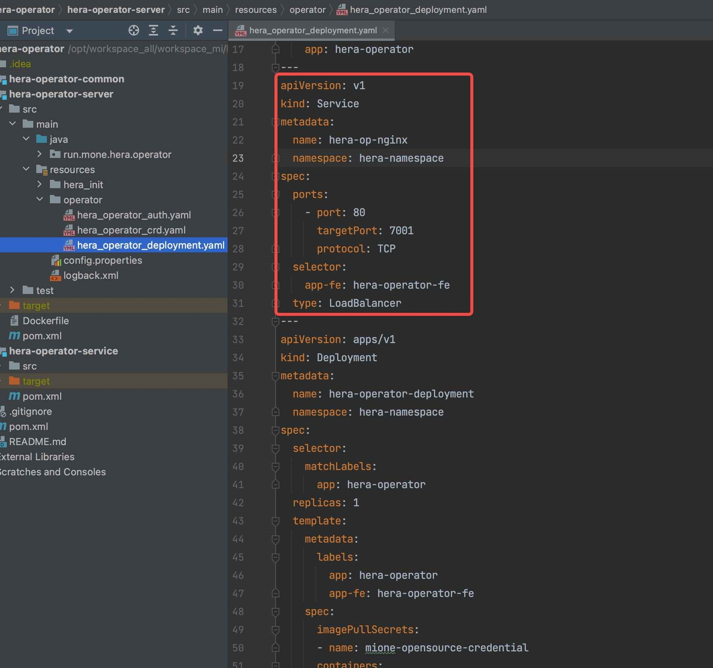
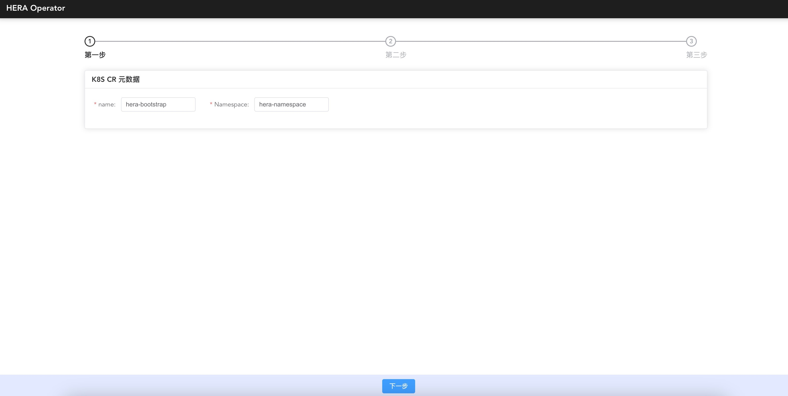
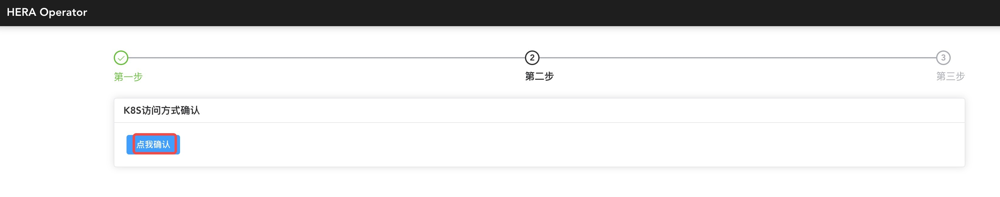

# OzHera部署文档

## 1.部署说明

OzHera operator的作⽤是在k8s集群中的指定namespace下⼀键拉起⼀个ozhera平台。该⽂档适⽤于有⼀定k8s基础(PV、PVC、Service、Pod、Deployment、DaemonSet等)的研发/运维同学。

OzHera是⼀套企业级的可观测性平台，部署时复杂度⾮常⾼，部署前请认真阅读以下部署⽂档及相关的
[operator介绍视频](https://mp.weixin.qq.com/s?__biz=MzkwMjQzMzMxMg==&mid=2247483720&idx=1&sn=c38fca2d3e82de43ce22acad73a1be21&chksm=c0a4de07f7d35711c5cba634c3833708db19fcc9303a50b77f8c1601831cac8e9520e3f32ff5&token=1000658198&lang=zh_CN#rd)。

## 2.部署步骤

ozhera-all/ozhera-operator/ozhera-operator-server/src/main/resources/operator/

### 2.1 创建独⽴命名空间及账号

* 执⾏命令，⽣效auth yaml（默认会⽣成空间：ozhera-namespace，账号：admin-mone）

  `kubectl apply -f ozhera_operator_auth.yaml`

### 2.2 创建 ozhera CRD

* 执⾏命令，⽣效crd yaml

  `kubectl apply -f ozhera_operator_crd.yaml`

### 2.3 部署operator

* 执⾏命令，部署operator

  `kubectl apply -f ozhera_operator_deployment.yaml`

* 确保部署的operator⼯程端⼝7001，能够对外访问。ozhera部署需要在operator提供的对外⻚⾯上进⾏操作。默认例⼦中使⽤LoadBalancer⽅式对外暴露可访问的ip、port。如需使⽤其它⽅式请⾃⾏修改yaml。

### 2.4 Operator⻚⾯操作

#### 2.4.1 访问operator⻚⾯

如果是使⽤2.3步中LoadBalancer⽅式，请先找到"ozhera-op-nginx" service的对外ip。执⾏命令：

`kubectl get service -n=ozhera-namespace`

找到ozhera-op-nginx对应的EXTERNAL-IP，默认访问地址：`http://EXTERNAL-IP:80/` 

可⻅如下界⾯：

#### 2.4.2 operator元数据填写

* name：ozhera-bootstrap

  k8s⾃定义资源名称，保持默认值不变。

* Namespace：ozhera-namespace

  ozhera部署的独⽴空间，建议保持ozhera-namespace不变，如需改变请注意yaml全局变更。

#### 2.4.3 k8s访问⽅式确认

该步骤是⽣成ozhera平台中需要对外开放⻚⾯的访问ip:port。当前只⽀持k8s的LoadBalancer、NodePort⽅式。默认会先尝试LB模式，如若不⽀持，则选择NodePort（如果NodePort的ip未开放对外访问，则需另起代理，建议集群开启LB）。

请记住ozhera.homepage.url，ozhera集群搭建完后，默认访问地址就是：http://${ozhera.homepage.url}

#### 2.4.4 集群配置

**k8s-serviceType请勿修改**

##### OzHera-mysql

⽬的是选择⼀个ozhera可⽤的mysql数据库。

* 如果需要k8s⾃动搭建⼀个数据库

  则开启"基于yaml创建资源"按钮，默认的yaml会创建⼀个pv进⾏mysql的数据存储，如果沿⽤默
  认的yaml，⼀定要注意：
  1. 提前在宿主机node上创建⽬录/opt/ozhera_pv/ozhera_mysql（可更换⽬录，同步修改此处yaml）；
  2. 找到创建⽬录的node名（可以执⾏ kubectl get node进⾏确认），替换此处的cn-bxxx52；
  3. 连接信息确保与yaml中信息⼀致，默认⽆需修改。
  

* 如果已有数据库，⽆需k8s创建
  1. 关闭"基于yaml创建资源"按钮；
  2. 填写正确的已有数据库url、⽤⼾名、密码；
  3. 默认operator执⾏时会⾃动去改数据库进⾏创建ozhera数据库及表，**如果填写的账号⽆建库、建表权限，则需提前⼿动去⽬标库中建好ozhera数据库和表**，建表语句在operator源码ozhera-all/ozhera-operator/ozheraoperator-server/src/main/resources/ozhera_init/mysql/sql ⽬录下。

##### OzHera-es

⽬的是选择⼀个OzHera可⽤的ES集群，并在ES中创建OzHera所需要的索引模板。

* 如果需要k8s⾃动搭建⼀个ES

  则需要开启“基于yaml创建资源”按钮。使⽤默认yaml创建的ES没有账号密码，如果需要设置账号密码，则需要：

  1. 修改左侧yaml中的xpack.security.enabled为true；
  2. 修改右侧“连接信息”中的ozhera.es.username与ozhera.es.password的值，⼀般地，我们都会⽤elastic的账号，密码需要在ES服务启动后进⾏设置；
  3. 在ES启动后，登⼊ES所在pod中，进⼊/usr/share/elasticsearch/bin⽬录执⾏elasticsearchsetup-passwords interactive命令，设置ES默认账号的密码，注意，这⾥设置的密码，需要与⻚⾯ozhera.es.password的值保持⼀致。

* 如果已有ES，⽆需k8s创建
  1. 关闭"基于yaml创建资源"按钮；
  2. 填写正确的已有ES集群的url、账号、密码；
  3. 默认operator执⾏时会⾃动创建索引模版。**如果填写的账号⽆创建索引模版的权限，则需要提前⼿动创建OzHera所需要的索引模版**。OzHera的索引模版在operator源码run.mone.ozhera.operator.common.ESIndexConst中，以json的格式存储。

##### OzHera-rocketMQ

⽬的是选择⼀个ozhera可⽤的RocketMQ

* 如果需要k8s⾃动搭建⼀个RocketMQ
  1. 需要开启“基于yaml创建资源”按钮；
  2. 使⽤默认yaml创建的RocketMQ没有accessKey\secretKey，如果需要设置accessKey\secretKey，则需要修改右侧“连接信息”中的ozhera.rocketmq.ak与ozhera.rocketmq.sk的值；
  3. 如果需要更换RocketMQ broker的service，需要同时替换yaml中的service，以及ozoperator代码中的run.mone.ozhera.operator.service.RocketMQSerivce类的成员变量"brokerAddr"的值。

* 如果已有RocketMQ，⽆需k8s搭建
  1. 关闭"基于yaml创建资源"按钮；
  2. 填写正确的已有RocketMQ集群的url、accessKey、secretKey；
  3. 默认operator执⾏时会⾃动创建OzHera所需要的topic。**如果填写的url、ak、sk没有权限创建topic，或者已有RocketMQ集群不允许通过API创建topic，则需要提前⼿动创建好topic**。OzHera需要的topic在operator源码run.mone.ozhera.operator.service.RocketMQSerivce类的成员变量"topics"中存储。

##### OzHera-redis

⽬的是选择⼀个ozhera可⽤的Redis

* 如果需要k8s⾃动搭建⼀个Redis

  则需要开启“基于yaml创建资源”按钮。使⽤默认yaml创建的redis没有密码，如果需要设置密码，则需要修改右侧ozhera.redis.password的值，与redis设置的密码保持⼀致。

* 如果已有Redis，⽆需k8s搭建
  1. 关闭"基于yaml创建资源"按钮；
  2. 填写正确的已有Redis集群的URL、密码。

##### OzHera-Nacos

ozhera集群内部的配置、注册中⼼，该集群建议⾛yaml创建⽅式，如果业务需要⾃⾏提供Nacos，请优先提供1.x版本的Nacos。

* 如果需要k8s⾃动搭建⼀个Nacos

  则需要开启“基于yaml创建资源”按钮，注意yaml中的镜像地址、资源⼤⼩配置及右侧连接信息与yaml中保持⼀致。

* 如果已有Nacos，⽆需k8s创建

  则需关闭“基于yaml创建资源”按钮，填写正确的nacos连接信息。

* Nacos配置

  operator会默认将这⾥所列的配置初始化为nacos配置，如果提供的不是基于yaml所创建的nacos，请确认连接信息有权限调⽤config创建接⼝，否则需要提前去⽬标nacos中⼿动创建好。

##### OzHera-Prometheus

⽬的是选择⼀个ozhera可⽤的prometheus。

如果沿⽤默认的yaml，⼀定要注意：

* 提前在宿主机node上创建⽬录/home/work/prometheus_ozhera_namespace_pv;
* 找到创建⽬录的node名（可以执⾏ kubectl get node进⾏确认），替换此处的cn- xxx。

##### OzHera-Alertmanager

⽬的是选择⼀个ozhera可⽤的alertmanager。

如果沿⽤默认的yaml，⼀定要注意：

* 提前在宿主机node上创建⽬录/home/work/alertmanager_ozhera_namespace_pv；
* 找到创建⽬录的node名（可以执⾏ kubectl get node进⾏确认），替换此处的cn-。

##### OzHera-Grafana

⽬的是选择⼀个ozhera可⽤的grafana。

如果沿⽤默认的yaml，⼀定要注意：

* 提前在宿主机node上创建⽬录/home/work/grafana_ozhera_namespace_pv；
* 找到创建⽬录的node名（可以执⾏ kubectl get node进⾏确认），替换此处的cn- beijingxxx；
* 在OzHera-mysql中配置的host、user、port、password等内容需要在ozhera-grafana的相应db配置中进⾏覆盖。

##### OzHera-Node-exporter

⽬的是选择⼀个ozhera可⽤的node-exporter。

如果沿⽤默认的yaml，⼀定要注意：

* 提前在宿主机找到⼀个可⽤Port，并填⼊下图中的hostPort处，默认为9101，修改完成后，同步更新右侧连接信息中的mione.k8s.node.port内容。

##### OzHera-Cadvisor

⽬的是选择⼀个ozhera可⽤的cadvisor。

如果沿⽤默认的yaml，⼀定要注意：

* 提前在宿主机找到⼀个可⽤Port，并填⼊下图中的hostPort处，默认为5195，修改后同步更新右侧连接信息中的mione.k8s.container.port内容。

##### OzHera-trace-etl-es

需要注意的是：

* 该服务是StatefulSet类型服务；
* 提前在宿主机node上创建⽬录/home/work/rocksdb（可更换⽬录，同步修改此处yaml）；
* 找到创建⽬录的node名（可以执⾏ kubectl get node进⾏确认），替换此处的nodeSelectorTerms下的values的值；
* 需要根据trace流量来修改pod副本数(replicas)与pod资源限制(resources)；
* 服务的pod副本数尽量与RocketMQ的queue size保持⼀致。

##### OzHera-trace-etl-manager

需要注意的是：

* 需要根据访问量来修改pod副本数(replicas)与pod资源限制(resources)。

##### OzHera-trace-etl-server

需要注意的是：

* 需要根据访问量来修改pod副本数(replicas)与pod资源限制(resources)
* 服务的pod副本数需要与RocketMQ的queue size保持⼀致

##### OzHera-monitor

ozhera-monitor是hera监控⾸⻚应⽤中⼼、指标监控、报警配置的后端服务，建议直接使⽤operator提供的基于yaml创建资源的⽅式部署。当然，也可以⾃⾏部署ozhera-monitor服务（关闭给予yaml资源创建的开关），⾃⼰部署服务，需要调整前端对接的相应参数：如ip地址、端⼝号等。

需要注意的是：

* MySQL

  在nacos配置MySQL的数据库，在对应的数据库名下按照ozhera-all/ozhera-monitor/sql ⽂件初始化数据库表。

* RocketMQ

  按照nacos上的配置，在对应的RocketMQ服务器上创建mq相应的topic和tag。

* ES

  按照nacos上的配置，在对应的ES服务器上创建es相应的索引。

* 使⽤operator⾃动创建资源，可以根据⾃⼰的实际流量情况调整副本数，replicas。实例中是⼀个副本；同样，可是根据需要在operator的yaml⽂件中调整k8s相关的资源，如 cpu、memory。

##### OzHera-fe

ozhera-fe是负责构建ozhera前端⻚⾯的yaml。

需要注意的是：

* 需要根据访问量来修改pod副本数(replicas)与pod资源限制(resources)。

##### OzHera-tpc-login

ozhera-tpc-login是负责构建tpclogin登陆服务后端的yaml。

需要注意的是：

* 需要根据访问量来修改pod副本数(replicas)与pod资源限制(resources)；
* 服务启动的配置像个信息在上⽅的nacos配置中。

##### OzHera-tpc-login-fe

ozhera-tpc-login-fe是负责构建tpclogin登录前端⻚⾯的yaml。

需要注意的是：

* 需要根据访问量来修改pod副本数(replicas)与pod资源限制(resources)。

##### OzHera-tpc

ozhera-tpc是负责构建tpc服务后端的yaml。

需要注意的是：

* 需要根据访问量来修改pod副本数(replicas)与pod资源限制(resources)；
* 服务相关配置在上⽅的nacos配置中配置。

##### OzHera-tpc-fe

ozhera-tpc-fe是负责构建tpc前端⻚⾯的yaml。

需要注意的是：

* 需要根据访问量来修改pod副本数(replicas)与pod资源限制(resources)。

##### OzHera-app

ozhera-app是负责负责hera系统中应⽤app相关逻辑操作，可以通过这个服务向外提供对应⽤的各种服务信息。

需要注意的是：

* 需要根据访问量来修改pod副本数(replicas)与pod资源限制(resources)。

##### OzHera-log-manager

ozhera-log-manager主要负责⻚⾯应⽤⽇志的接⼊，以及各种元数据的配置下发。

需要注意的是：

* 由于该服务需要对外提供http服务，因此需要开⼀个端⼝，端⼝默认来⾃与项⽬中的配置⽂件，默认为7788。

##### OzHera-log-stream

ozhera-log-stream负责消费mq中的应⽤⽇志信息，然后负责应⽤⽇志解析，最后存⼊存储空间(ES)。

需要注意的是：

* 该服务是StatefulSet类型服务；
* 需要注⼊⼀个环境变量MONE_CONTAINER_S_POD_NAME，值为容器pod的名称。

#### 2.4.5 集群部署

* 保存配置

    确保2.4.4步骤完毕后，点击保存配置，该步骤会完成:
  1. 整个配置的保持；
  2. nacos变量替换（nacos配置中有${变量}配置的，会⾃动完成⼀轮替换，替换值来源于输⼊的连接信息、第⼆步⽣成的访问⽅式 ip:port）。

* 集群⽣效

  确保"保存配置"已完成后，可点击"集群⽣效"进⾏整个hera集群的部署。